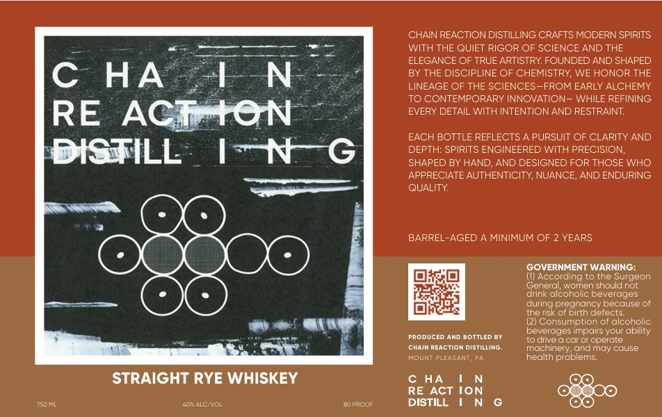

# TTB COLA Label Images - TTBID 26125001000005

**Brand Name:** CHAIN REACTION DISTILLING

**Issue Date:** 05/08/2026

**Origin Code:** 39

**Product Class/Type:** 102

**Source:** [TTB Public COLA Registry](https://ttbonline.gov/colasonline/viewColaDetails.do?action=publicFormDisplay&ttbid=26125001000005)

## Label Images

### Label 1

## Extracted Label Text

*Text extracted via OCR - may contain errors*

**Detected Age:** 2 Years

### Label 1

CHAIN REACTION DISTILLING CRAFTS MODERN SPIRITS
WITH THE QUIET RIGOR OF SCIENCE AND THE
ELEGANCE OF TRUE ARTISTRY FOUNDED AND SHAPED
C
HA
LN
BY THE DISCIPLINE OF CHEMISTRY; WE HONOR THE
LINEAGE OF THE SCIENCES-FROM EARLY ALCHEMY
TO CONTEMPORARY INNOVATION_ WHILE REFINING
RE
ACIATON
EVERY DETAIL WITH INTENTIONAND RESTRAINT:
EACH BOTTLE REFLECTS
PURSUIT OF CLARITY AND
DISTILL
IN
DEPTH: SPIRITS ENGINEERED WITH PRECISION,
SHAPED BY HAND
AND DESIGNED FOR THOSE WHO
APPRECIATE AUTHENTICITY; NUANCE; AND ENDURING
QUALITY
BARREL-AGED
MINIMUM OF 2 YEARS
GOVERNMENT WARNING:
(1 According to the Surgeon
General
wcmen should not
drink alcoholc beverages
during pregnancy because of
the risk of birth defects:
consumption of alconolic
beverages impairs your ability
Produccc
AND BOTTLED BY
to dive
car 0r operate
CHAIN REACTION DISTILLING
machinery; andmay cause
MOUNT PLEASANT; Pa
health problems
STRAIGHT RYE WHISKEY
c HA
RE ACT ION
40" ALC VOL
f0 pepl
DISTILL
