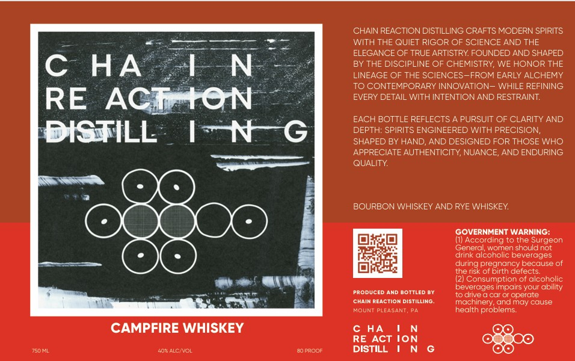

# TTB COLA Label Images - TTBID 26125001000006

**Brand Name:** CHAIN REACTION DISTILLING

**Fanciful Name:** CAMPFIRE WHISKEY

**Issue Date:** 05/11/2026

**Origin Code:** 39

**Product Class/Type:** 140

**Source:** [TTB Public COLA Registry](https://ttbonline.gov/colasonline/viewColaDetails.do?action=publicFormDisplay&ttbid=26125001000006)

## Label Images

### Label 1

## Extracted Label Text

*Text extracted via OCR - may contain errors*

### Label 1

CHAIN REACTION DISTILLING CRAFTS MODERN SPIRITS
WITH THE QUIET RIGOR OF SCIENCE AND THE
ELEGANCE OF TRUE ARTISTRY FOUNDED AND SHAPED
C
HA
LN
BY THE DISCIPLINE OF CHEMISTRY, WE HONOR THE
LINEAGE OF THE SCIENCES
FROM EARLY ALCHEMY
TO CONTEMPORARY INNOVATION ~ WHILE REFINING
RE
ACTAON
EVERY DETAIL WITH INTENTION AND RESTRAINT:
EACH BOTTLE REFLECTS
PURSUIT OF CLARITY AND
DISTILL
1N
G
DEPTH: SPIRITS ENGINEERED WITH PRECISION,
SHAPED BY HAND
AND DESIGNED FOR THOSE WHO
APPRECIATE AUTHENTICITY; NUANCE
AND ENDURING
QUALITY
BOURBON WHISKEY AND RYE WHISKEY
GOVERNMENT WARNING:
(1) According to the Surgeon
General, women should not
drink alcoholic beverages
during
(pregindnce
because of
the risk of =
detects:
(21 Consumption of alcoholic
beverages impairs your ability
PRODUCED AND BOTTLED @Y
to dive
car Or operate
CHAIM REACTION DISTILLING:
machinery, andmay cause
MOUNT PLEASANT, Pa
health problems
CAMPFIRE WHISKEY
c HA
{on
RE ACT
750ML
40" ALCNOL
90 prooi
DISTILL
