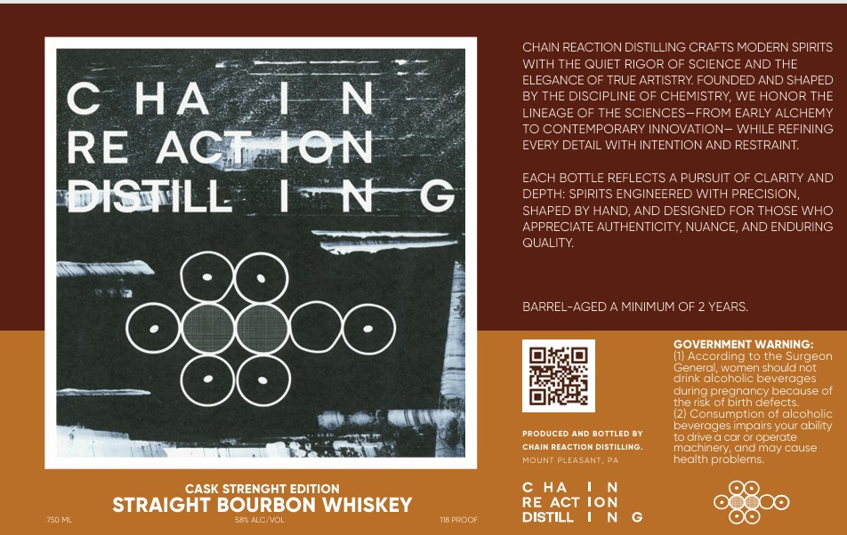

# TTB COLA Label Images - TTBID 26125001000009

**Brand Name:** CHAIN REACTION DISTILLING

**Issue Date:** 05/12/2026

**Origin Code:** 39

**Product Class/Type:** 101

**Source:** [TTB Public COLA Registry](https://ttbonline.gov/colasonline/viewColaDetails.do?action=publicFormDisplay&ttbid=26125001000009)

## Label Images

### Label 1

## Extracted Label Text

*Text extracted via OCR - may contain errors*

**Detected Age:** 2 Years

### Label 1

CHAIN REACTION DISTILLING CRAFTS MODERN SPIRITS
WITH THE QUIET RIGOR OF SCIENCE AND THE
ELEGANCE OF TRUE ARTISTRY FOUNDED AND SHAPED
C
HA
1 N
BY THE DISCIPLINE OF CHEMISTRY, WE HONOR THE
LINEAGE OF THE SCIENCES-FROM EARLY ALCHEMY
TO CONTEMPORARY INNOVATION- WHILE REFINING
RE
ACTAON
EVERY DETAIL WITH INTENTIONAND RESTRAINT
EACH BOTTLE REFLECTS
PURSUIT OF CLARITY AND
DISTILL
1N
DEPTH: SPIRITS ENGINEERED WITH PRECISION,
SHAPED BY HAND,
AND DESIGNED FOR THOSE WHO
APPRECIATE AUTHENTICITY, NUANCE, AND ENDURING
QUALITY
BARREL-AGED A MINIMUM OF 2 YEARS
GOVERNMENT WARNING:
(I) According to tne Surgeon
General; women should not
drink alcoholic beverages
during pregnancy because of
the risk of birth detects:
21 Consumption of alcoholic
beverages impairs your ability
PRODUCED AND BOTTLED DY
To uive
car 0l cperate
CHAIM REACTION DISTILLING:
machinery, andmay cause
MOUNI
PLEACENT
health problems
CASK STRENGHT EDITION
HA
{on
STRAIGHT BOURBON WHISKEY
RE ACT
750 NL
ACNYOL
TIB FROOR
DISTILL
