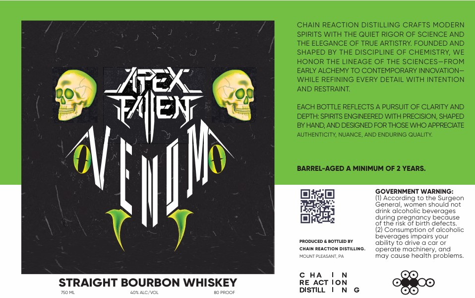

# TTB COLA Label Images - TTBID 26125001000015

**Brand Name:** APEXFALLEN VENOM

**Issue Date:** 05/08/2026

**Origin Code:** 39

**Product Class/Type:** 101

**Source:** [TTB Public COLA Registry](https://ttbonline.gov/colasonline/viewColaDetails.do?action=publicFormDisplay&ttbid=26125001000015)

## Label Images

### Label 1

## Extracted Label Text

*Text extracted via OCR - may contain errors*

**Detected Age:** 2 Years

### Label 1

CHAIN REACTION DISTILLING CRAFTS MODERN
SPIRITS WITH THE QUIET RIGOR OF SCIENCE AND
THE ELEGANCE OF TRUE ARTISTRY: FOUNDED AND
SHAPED BY THE DISCIPLINE OF CHEMISTRY, WE
HONOR THE LINEAGE OF THE SCIENCES-FROM
EARLY ALCHEMY TO CONTEMPORARY INNOVATION-
WHILE REFINING EVERY DETAIL WITH INTENTION
AND RESTRAINT
EACH BOTTLE REFLECTS A PURSUIT OF CLARITY AND
TAEN
DEPTH: SPIRITS ENGINEERED WITH PRECISION, SHAPED
BY HAND, AND DESIGNED FOR THOSE WHO APPRECIATE
AUTHENTICITY, NUANCE, AND ENDURING QUALITY:
BARREL-AGED A MINIMUM OF 2 YEARS:
GOVERNMENT WARNING:
(I) According to the Surgeon
Ceneral; women should not
drink alcoholic beverages
auring pregnancy pecause
the risk of birth defects_
Consumption of alcoholic
beverages impairs your
PRODUCEC
BOTTLED BY
ability t0 drive & car Or
CHAIN REACTiON DistiLLINo.
operate machinery,
You PLEASENT
may cause health problems_
c HA
STRAIGHT BOURBON WHISKEY
RE ACT
ion
750 ML
40"ALC/VOL
BO PRCOF
DISTILL
NShw
and
