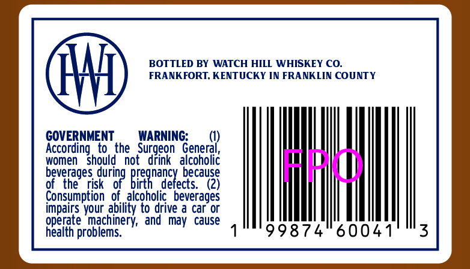
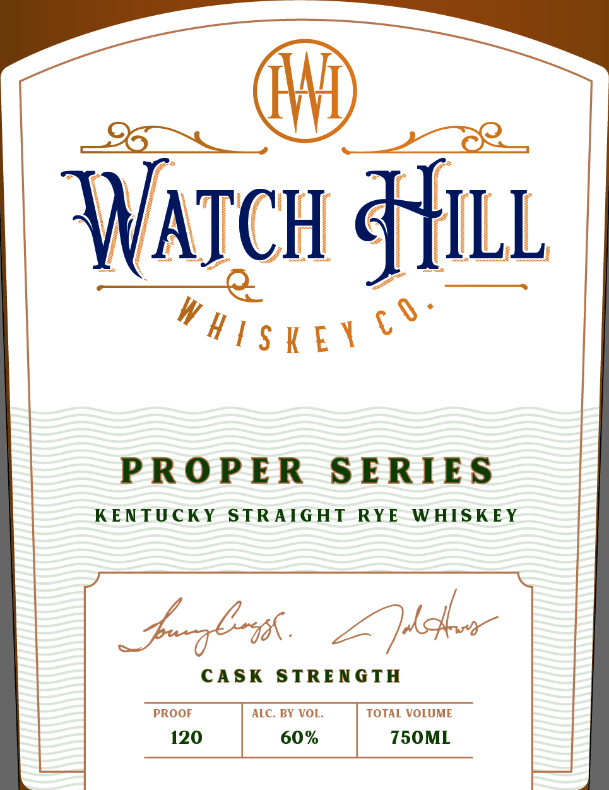

# TTB COLA Label Images - TTBID 26125001000194

**Brand Name:** WATCH HILL WHISKEY CO.

**Fanciful Name:** PROPER SERIES - KENTUCKY STRAIGHT RYE WHISKEY

**Issue Date:** 05/07/2026

**Origin Code:** 22

**Product Class/Type:** 102

**Source:** [TTB Public COLA Registry](https://ttbonline.gov/colasonline/viewColaDetails.do?action=publicFormDisplay&ttbid=26125001000194)

## Label Images

### Back Label

### Label 1

## Extracted Label Text

*Text extracted via OCR - may contain errors*

### Back Label

BOTTLED BY WATCH HILL WHISKEY CO.
FRANKFORT, KENTUCKY IN FRANKLIN COUNTY

GOVERNMENT WARNING: (I) | H
According to the Surgeon General,
women should not drink alcoholic
beverages durin pre ancy because

of the risk of birth defects. (2)
Consumption of alcoholic beverages
malts your solity to ae a car or
operate machinery, and may cause
health problems. " 1°"99874 6004

### Label 1

RYE WHISKEY

PROPER SERIES
KENTUCKY STRAIGHT
