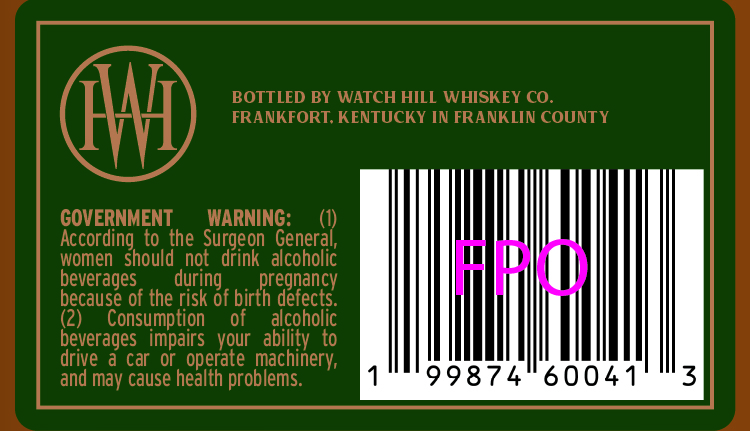
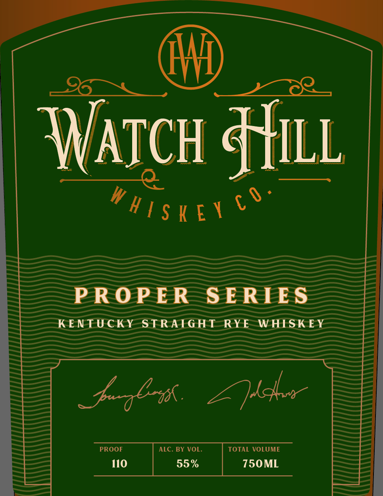

# TTB COLA Label Images - TTBID 26125001000206

**Brand Name:** WATCH HILL WHISKEY CO.

**Fanciful Name:** PROPER SERIES - KY STRAIGHT RYE WHISKEY 110

**Issue Date:** 05/07/2026

**Origin Code:** 22

**Product Class/Type:** 102

**Source:** [TTB Public COLA Registry](https://ttbonline.gov/colasonline/viewColaDetails.do?action=publicFormDisplay&ttbid=26125001000206)

## Label Images

### Back Label

### Label 1

## Extracted Label Text

*Text extracted via OCR - may contain errors*

**Detected Proof:** 110

### Back Label

BOTTLED BY WATCH HILL WHISKEY CO.
FRANKFORT; KENTUCKY IN FRANKLIN COUNTY
GOVERNMENT
WARNING:
According to, the
General_
women   should  not
Surgeon ZGeoregac
lhad
beceragesf the dusinaf =
birtfreenarcy
(2)
Consumption
of
alcoholic
beverages
impairs   your   ability   to
drive
a car or, operate machinery;
and may cause health problems.
9874"60041
3

### Label 1

NATCH Hit

Wire

PROPER SERIES

KENTUCKY STRAIGHT RYE WHISKEY

paglh Zehr

PROOF

110

ALC. BY VOL.

55%

750ML
