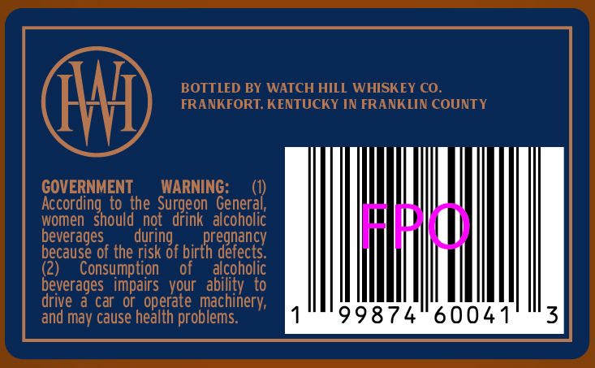
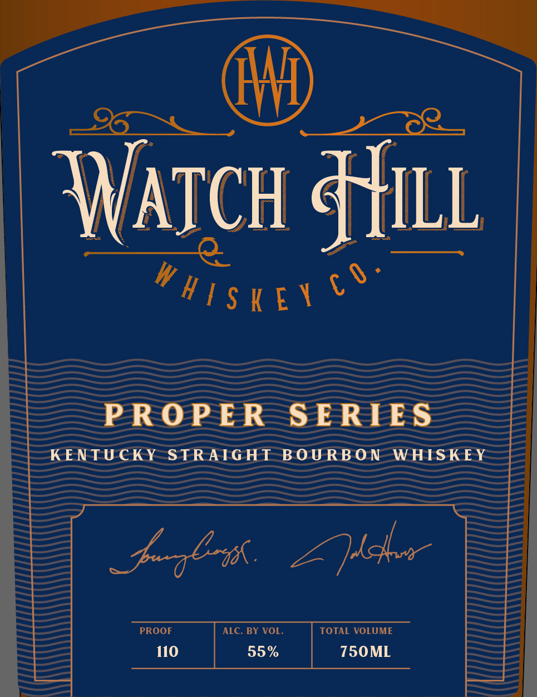

# TTB COLA Label Images - TTBID 26125001000212

**Brand Name:** WATCH HILL WHISKEY CO.

**Fanciful Name:** PROPER SERIES - KENTUCKY STRAIGHT BOURBON WHISKEY 110

**Issue Date:** 05/07/2026

**Origin Code:** 22

**Product Class/Type:** 101

**Source:** [TTB Public COLA Registry](https://ttbonline.gov/colasonline/viewColaDetails.do?action=publicFormDisplay&ttbid=26125001000212)

## Label Images

### Back Label

### Label 1

## Extracted Label Text

*Text extracted via OCR - may contain errors*

**Detected Proof:** 110

### Back Label

BOTTLED BY WATCH HILL WHISKEY CO.
FRANKFORT KENTUCKY IN FRANKLIN COUNTY
GOVERNMENT
WARNING:
According to,the
Suggeon BGeotecac
women   should   not
alcoholic
lham
becerseesf the dusingf
F birtkr eenency
defects
(2)
Consumption
alcoholic
beverages   impairs   your   ability   to
drive
a car
or , operate  machinery;
and may cause health problems.
987 4
60041

### Label 1

ATCH &HILL
PROP ER
SE RIES
K ENTU CKY
STRATGHT BOU RB 0 N
WHISK E Y
J &l-a.
2l4x
PROOF
ALC. BY VOL
TOTAL VOLUME
110
55 %
750ML
c 0
W H [ $ K E Y
