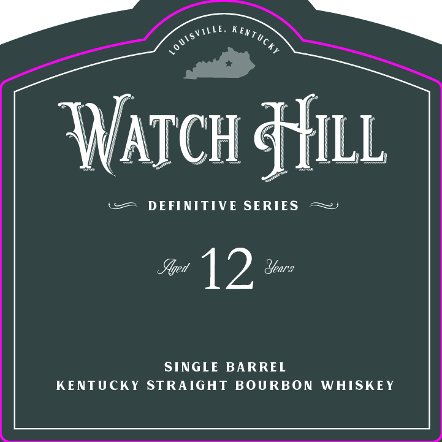

# TTB COLA Label Images - TTBID 26125001000220

**Brand Name:** WATCH HILL WHISKEY CO.

**Fanciful Name:** DEFINITIVE 11 - SINGLE BARREL

**Issue Date:** 05/08/2026

**Origin Code:** 22

**Product Class/Type:** 101

**Source:** [TTB Public COLA Registry](https://ttbonline.gov/colasonline/viewColaDetails.do?action=publicFormDisplay&ttbid=26125001000220)

## Label Images

### Front Label

### Label 2

## Extracted Label Text

*Text extracted via OCR - may contain errors*

**Detected Proof:** 100
**Detected Age:** 12 Years

### Front Label

MLE,
WNatch HHill
DEFINITIVE SERIES
Yged
12
Years
SINGLE
BARREL
KENTUCKY
STRAIGHT
BOURBON
WHISKEY
KenTucky
L0 UISVT

### Label 2

BATCH

TOTAL VOLUME 375ML

FOUNDERS

Paget. Zhe

PROOF

100

SINGLE BARREL
KENTUCKY STRAIGHT
BOURBON WHISKEY

‘ALC. BY VOL.

50%

NON-CHILL FILTERED

‘WATCHHILLWHISKEYCO.COM

IN THE REALM OF MUSIC, A ‘STANDARD’ REFERS TO A
SONG THAT HAS ENDURED OVER TIME AND COME TO
DEFINE A GENRE. SIMILARLY, THERE ARE BOTTLES THAT
DEFINE THE LONG AND STORIED HISTORY OF WHISKEY
IN AMERICA. THE DEFINITIVE SERIES IS CRAFTED TO
ENDURE THE TEST OF TIME AND EMERGE AS THE
UNEQUIVOCAL STANDARD OF AMERICAN WHISKEY. =~»

BOTTLED BY WATCH HILL
WHISKEY CO. FRANKFORT,
KENTUCKY IN FRANKLIN COUNTY

GOVERNMENT WARNING: (1) According to
the Surgeon General, women should not
drink alcoholic beverages curing pregnanc'
because of the risk of birth defects. fay
Consumption of alcoholic beverages impairs
your ability to drive a car or operate
machinery, and may cause health problems.

1 IM
