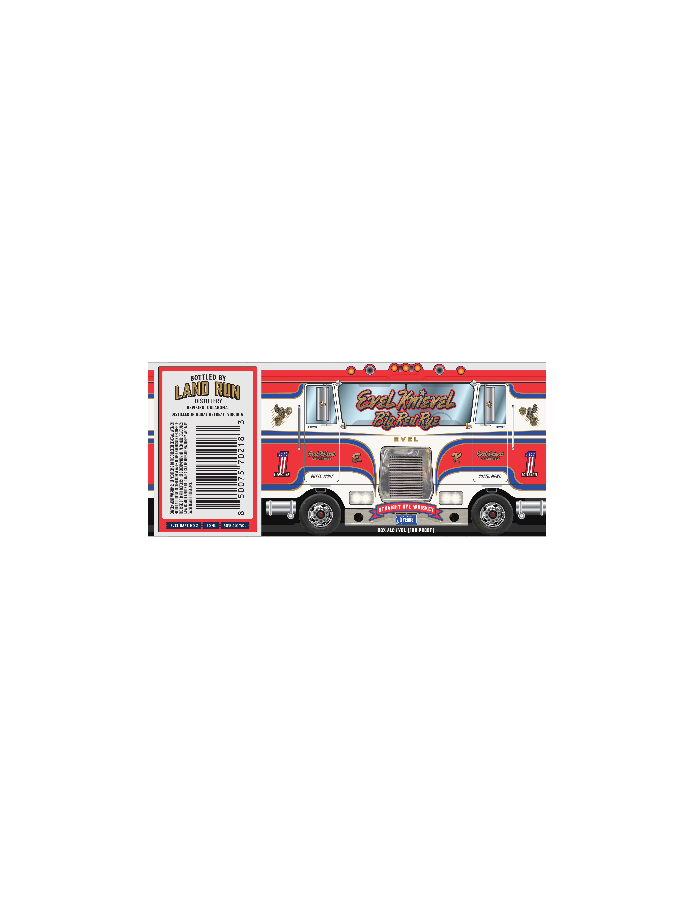

# TTB COLA Label Images - TTBID 26125001000322

**Brand Name:** LAND RUN DISTILLERY

**Fanciful Name:** BIG RED RYE

**Issue Date:** 05/07/2026

**Origin Code:** 37

**Product Class/Type:** 102

**Source:** [TTB Public COLA Registry](https://ttbonline.gov/colasonline/viewColaDetails.do?action=publicFormDisplay&ttbid=26125001000322)

## Label Images

### Label 1

## Extracted Label Text

*Text extracted via OCR - may contain errors*

**Detected Proof:** 100

### Label 1

BOTTLED BY
DISTILLERY
RuN
GvelKnar
NEWKIRK , OKLAHOMA
DISTILLED IN RURAL RETREAT, VIRGINIA
Jj
1
BiRnba
8
EVEL
8

1
H
3
EvelKaevel
ENTERPRISES
EvelKuevl
enterprises
j
E2
3
EELkw
BUTTe, MOnt;
BUTTE, MONT
WEkNW
=
1
2
8
H4
2
8
1ii
1
RYE
3 YERRs
EVEL DARE NO.2
50 ML
50% ALC /VOL
50% ALC / VOL (10O PROOF)
Land
STRAICHT
WHISKEY
