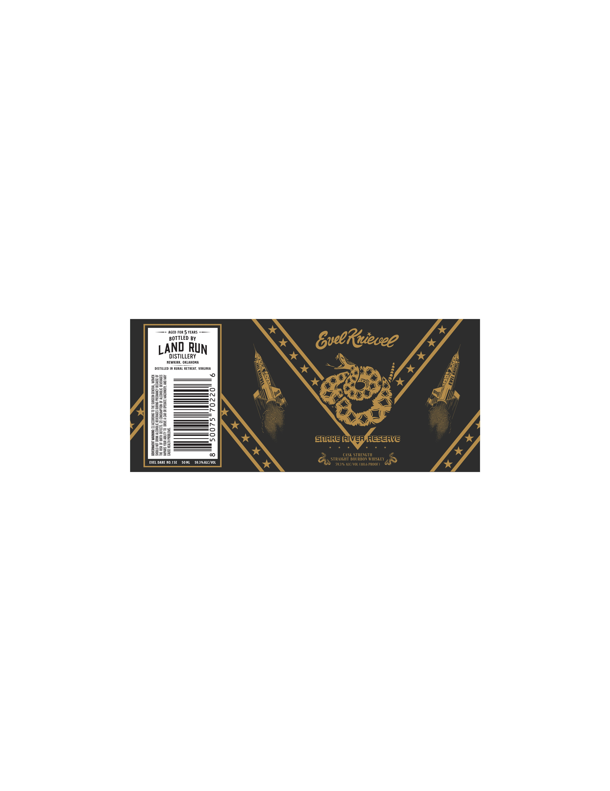

# TTB COLA Label Images - TTBID 26125001000329

**Brand Name:** LAND RUN DISTLLERY

**Fanciful Name:** SMALE RIVER RESERVE

**Issue Date:** 05/07/2026

**Origin Code:** 37

**Product Class/Type:** 101

**Source:** [TTB Public COLA Registry](https://ttbonline.gov/colasonline/viewColaDetails.do?action=publicFormDisplay&ttbid=26125001000329)

## Label Images

### Label 1

## Extracted Label Text

*Text extracted via OCR - may contain errors*

**Detected Proof:** 118.6
**Detected Age:** 5 Years

### Label 1

02202,S200S

59.3% ALC/VOL

50ML

AMIN CNY AQSNIHOWIN JLWU3d0 YO UW W IARC OL ALITIGW UNDA SUIvdINT
S30VUINGG INOHOIY 40 NOLAWNSNOD (2) °S193490 H1MIG 40 ASIY IHL
40 FSNVOI9 AINWNSTYd ONIANG S3OVUIATG INCHOIT ANNO LON CTNCHS
N3NOM “TWY3N39 NOIOUNS 3HL OL ONIGUOIOY (1) “ONINAWIM LNAWNYSADS

BOTTLED BY
DISTILLERY
NEWKIRK, OKLAHOMA
DISTILLED IN RURAL RETREAT, VIRGINIA

LAND RUN

“SWTT80Ud HLTH 3SMVO

——- AGED FOR 5 YEARS -——

EVEL DARE NO.1SE
