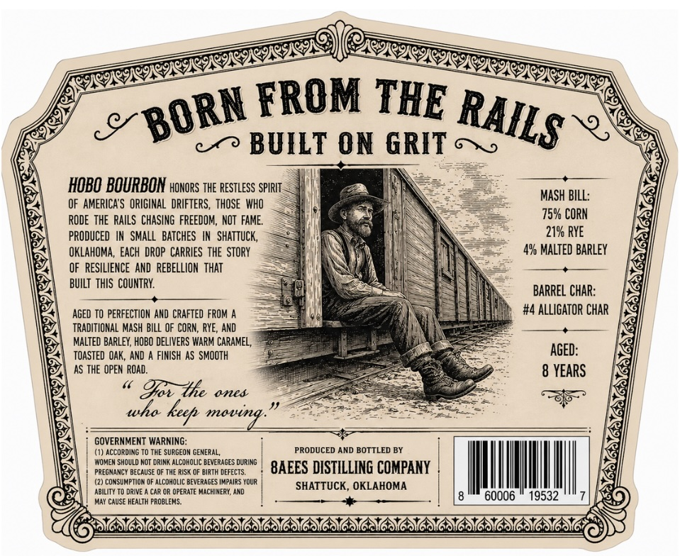
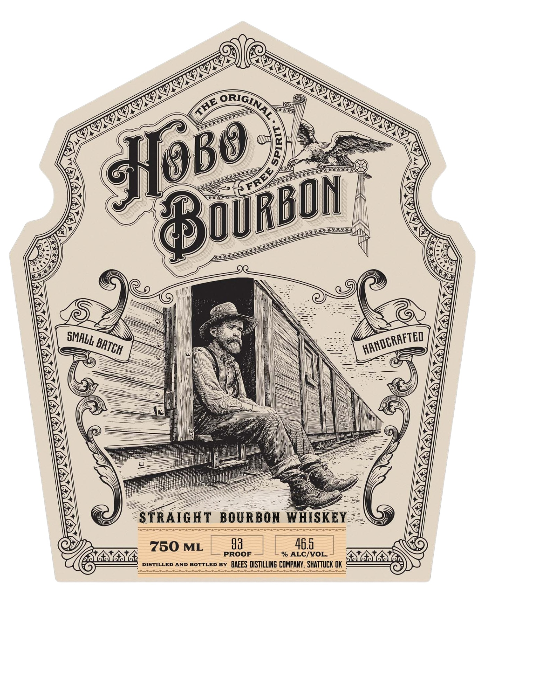
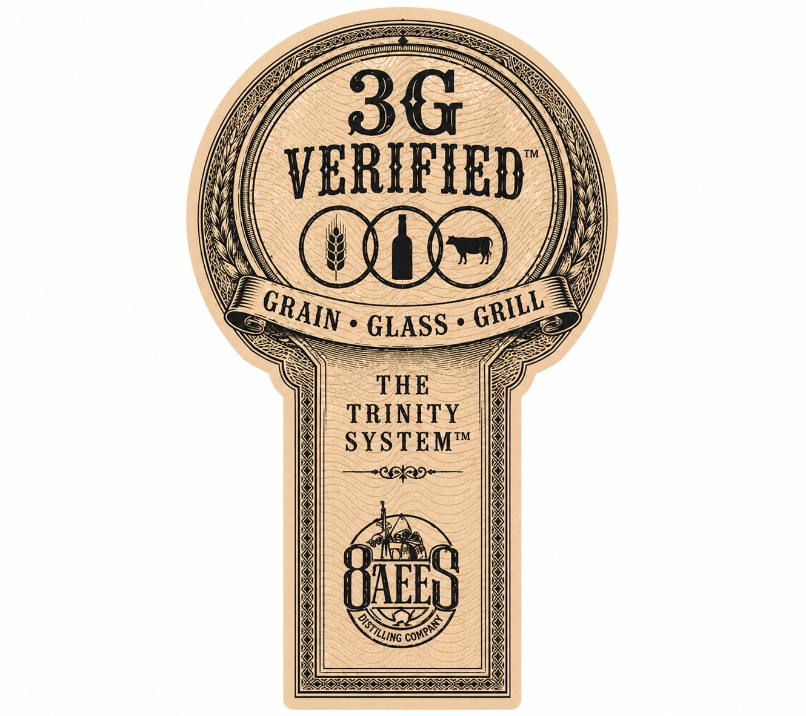

# TTB COLA Label Images - TTBID 26125001000335

**Brand Name:** HOBO BOURBON

**Issue Date:** 05/07/2026

**Origin Code:** 37

**Product Class/Type:** 101

**Source:** [TTB Public COLA Registry](https://ttbonline.gov/colasonline/viewColaDetails.do?action=publicFormDisplay&ttbid=26125001000335)

## Label Images

### Back Label

### Front Label

### Label 3

## Extracted Label Text

*Text extracted via OCR - may contain errors*

**Detected Age:** 8 Years

### Back Label

FROM
BUILT ON GRIT
HOBO BOURBON honors ThE Restless SPIRIT
MASH BILL:
OF   AMERICAS   ORIGINAL  DRIFTERS , THOSE WHO
ROdE thE  RAILS  CHASING  FREEDOM, NOT  FAME.
75% CORN
PRODUCED
IN  SMALL   BATCHES
IN  SHATTUCK,
219 RYE
OKLAHOMA , Each  DROP  CARRIES   THE  STORY
4% MALTED BarleY
OF   RESILIENCE   AND   REBELLIOM   thAT
BUILT  thIS  COUNTRY
BARREL CHAR:
AGED TO PERFECTION ANd  CRAFTED FROM
#4 ALLIGATOR CHAR
TRADITIONAL Mash Bill Of CORN, RYE, ANd
MALTED BARLEY, HOBO DELIVERS WARM CARAMEL,
TOASTED OAK, AND
FINISH AS SMOOTH
AGED:
AS THE OPEN ROAD.
8 YEARS
91cz  the
ones
tuha
moving_
GOVERNMENT WARNING_
(1) AccoRdING T0 TH
SURGEOM GENERAL,
PRODUCED AND BOTTLED BY
WoMen SHQULO NOT DRInk ALCOHOLIC BEVERAGES DUring
PReGNancy BEcAUSE OF THE RiSk
BIRTH DEFECTS
8AEES DISTILLING COMPANY
(2) consuMPTIOH
alcoholIc BEVERAGES |MpaIRS YOUR
SHATTUCK, OKLAHOMA
ABILITY TO DRIVE _
Car OR OPERATE MACHIMERU, AND
60006
19532
May CAUSE HEALTH PROBLEMS:
THE
BORN
RAILS
6 > )
keh

### Front Label

0
STRAIGHT
BOURBON WHISKEY
750 ML
93
46.5
sG
PROOF
% ALC/VOL
DISTILLED AND BOTTLED BY
BAEES DISTILLING COMPANY , SHATTUCK OK
ORIGINA
THE
GHOBO
FREE
BoURBON
SMALL
HANDCRAFTED
BATCH

### Label 3

36
VEREFTED
GLASS
THE
TRINITY
SYSTEMT
UHEO
GRAIN
GRILL
DISTILLING =
COMPANY
