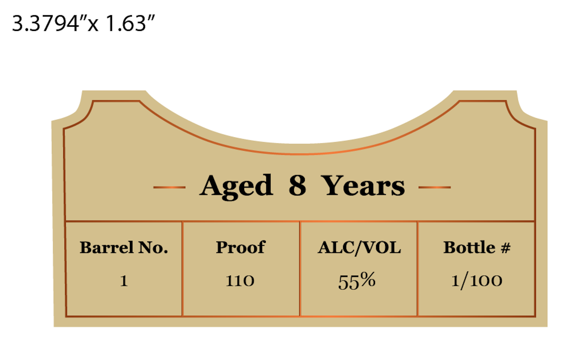
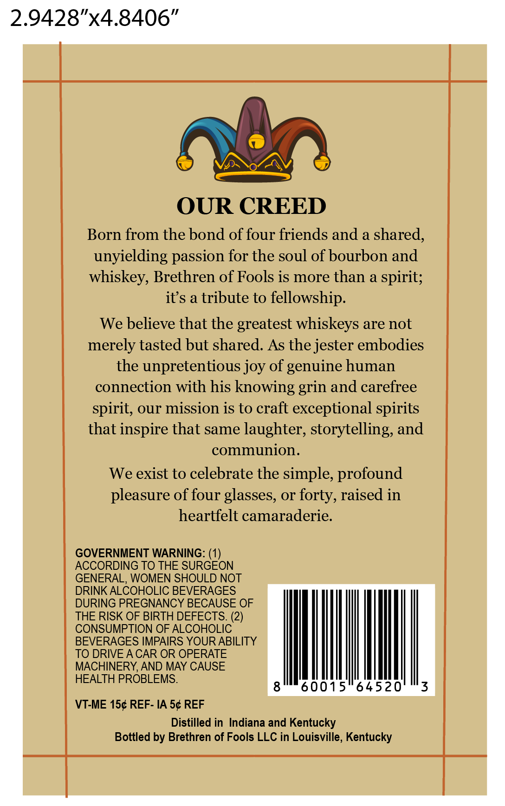

# TTB COLA Label Images - TTBID 26125001000381

**Brand Name:** BRETHREN OF FOOLS

**Issue Date:** 05/08/2026

**Origin Code:** 22

**Product Class/Type:** 101

**Source:** [TTB Public COLA Registry](https://ttbonline.gov/colasonline/viewColaDetails.do?action=publicFormDisplay&ttbid=26125001000381)

## Label Images

### Front Label

### Label 3

## Extracted Label Text

*Text extracted via OCR - may contain errors*

**Detected Proof:** 110
**Detected Age:** 8 Years

### Front Label

3.3794"x 1.63"

Aged 8 Years

Barrel No.

Proof

ALC/VOL

Bottle #

1

110

55%

1/100

### Label 3

sss

VONOAV EES

OUR CREED

Born from the bond of four friends and a shared,

unyielding passion for the soul of bourbon and

whiskey, Brethren of Fools is more than a spirit;

it’s a tribute to fellowship.

We believe that the greatest whiskeys are not

merely tasted but shared. As the jester embodies

the unpretentious joy of genuine human

connection with his knowing grin and carefree

spirit, our mission is to craft exceptional spirits

that inspire that same laughter, storytelling, and

communion.

We exist to celebrate the simple, profound

pleasure of four glasses, or forty, raised in

heartfelt camaraderie.

GOVERNMENT WARNING: (1)

ACCORDING TO THE SURGEON

GENERAL, WOMEN SHOULD NOT

DRINK ALCOHOLIC BEVERAGES

DURING PREGNANCY BECAUSE OF

THE RISK OF BIRTH DEFECTS. (2)

CONSUMPTION OF ALCOHOLIC

BEVERAGES IMPAIRS YOUR ABILITY

TO DRIVE ACAR OR OPERATE

MACHINERY, AND MAY CAUSE

HEALTH PROBLEMS.

VT-ME 15¢ REF- IA 5¢ REF

Distilled in Indiana and Kentucky

Bottled by Brethren of Fools LLC in Louisville, Kentucky

Sf
