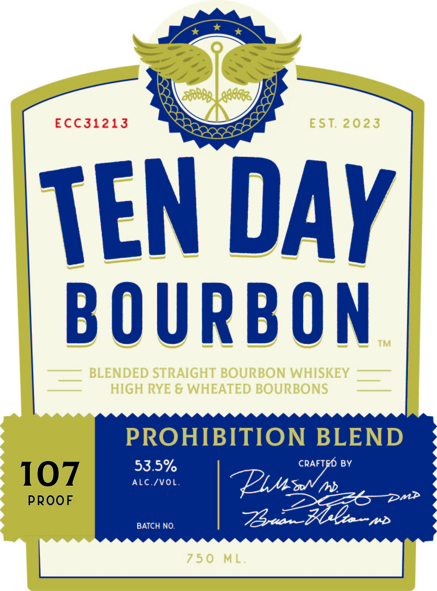
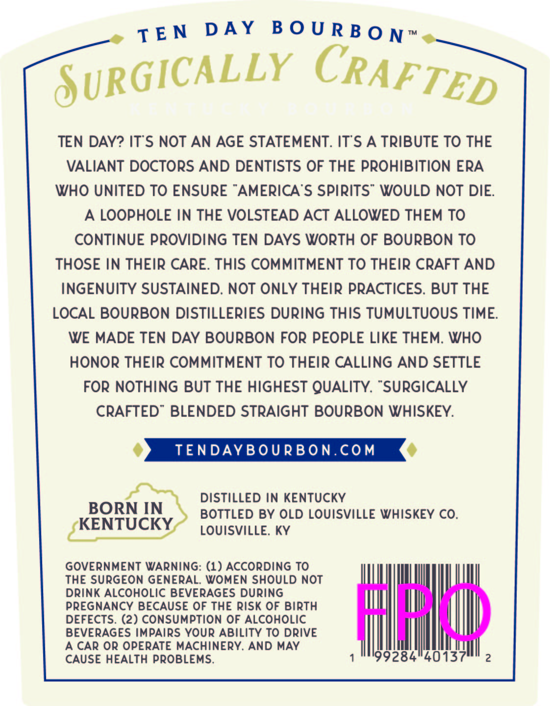

# TTB COLA Label Images - TTBID 26125001000392

**Brand Name:** TEN DAY BOURBON PROHIBITION BLEND

**Issue Date:** 05/14/2026

**Origin Code:** 22

**Product Class/Type:** 121

**Source:** [TTB Public COLA Registry](https://ttbonline.gov/colasonline/viewColaDetails.do?action=publicFormDisplay&ttbid=26125001000392)

## Label Images

### Label 1

### Label 2

### Label 3

## Extracted Label Text

*Text extracted via OCR - may contain errors*

**Detected Proof:** 107

### Label 1

Bnealaade
ECC31213
EST 2023
TEN DAY
BOURBON
TM
BLENDED STRAIGHT BOURBON WHISKEY
HIGH RYE & WHEATED BOURBONS
PROHIBITION BLEND
53.5%
CRAFTFO BV
107
ALc /VoL.
PROoF
73 ~
'~DMP
BATCH NO:
7 5 0
ML

### Label 2

per

By

Nd

>

DOCTORS BLEND BOURBON WHISKEY CO.

EtT?eTeI24

iY \\

"

tant

&

### Label 3

D A Y
B 0 U R B 0 N "
8URGICALLY

TEN DAY? ITS NOT AN AGE STATEMENT. ITS A TRIBUTE TO THE
VALIANT DOCTORS AND DENTISTS OF THE PROHIBITION ERA
WHO UNITED TO ENSURE
AMERICA S SpiRits" WOULD NOT DIE
A LOOPHOLE IN THE VOLSTEAD ACT ALLOWED THEM TO
CONTINUE PROVIDING TEN DAYS WORTH OF BOURBON TO
THOSE IN THEIR CARE: THIS COMMITMENT To THEIR CRAFT AND
INGENUITY SUSTAINED: NOT ONLY THEIR PRACTICES. BUT THE
LOCAL BOURBON DISTILLERIES DURING THIS TUMULTUOUS TIME
WE MADE TEN DAY BOURBON FOR PEOPLE LIKE THEM: WHO
HonoR THEIR COMMITMENT TO THEIR CALLING AND SETTLE
FOR NOTHING BUT THE HIGHEST QUALITY:
SURGICALLY
CRAFTED'
BLENDED STRAIGHT BOURBON WHISKEY:
TENDAYBOURBon.Com
DISTILLED IN KENTUCKY
BORN IN
BOTTLED BY OLD LOUISVILLE WHISKEY CO.
KENTUCKY
LOUISVILLE; KY
GOVERNMENT WARNiNG: (1) ACCORDING To
THE SurGEON GENERAL: WOMEN SHOULD not
DRink ALCOHOLIC BEVERAGES During
PREGNANCY BECAUSE OF THE Risk OF Birth
Hdd
DEFECTS. (2) ConsUMPTion OF ALCOHOLIC
BEVERAGES IMPAIRS Your ABiLiTY To DRIVE
A CAR OR OPERATE MACHINERY. AND MAY
CAUSE HEALTH PROBLEMS:
199284"40137
2
TE N
CRAFTED
