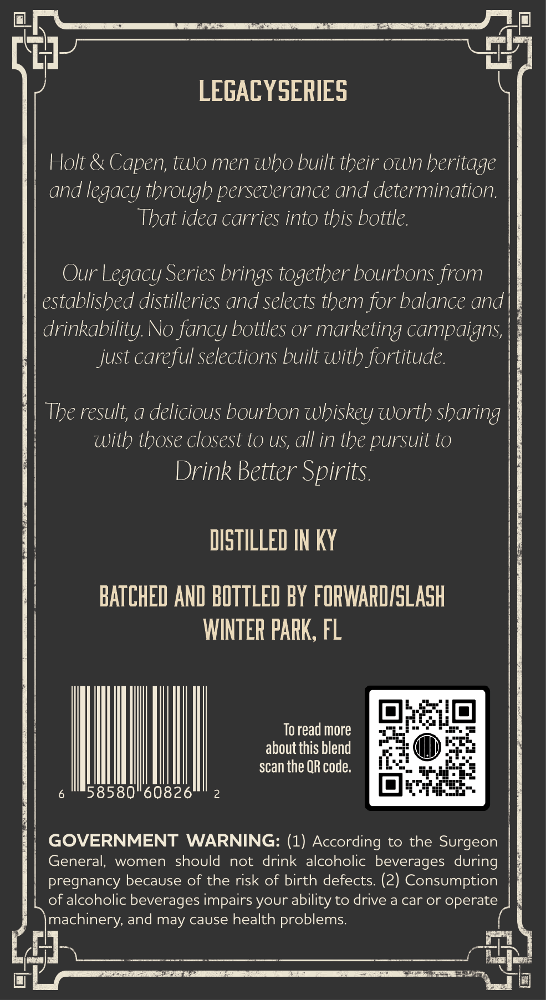
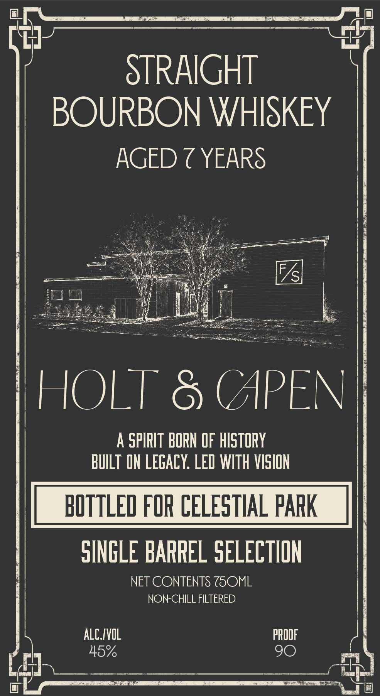

# TTB COLA Label Images - TTBID 26125001000435

**Brand Name:** HOLT & CAPEN

**Issue Date:** 05/13/2026

**Origin Code:** 16

**Product Class/Type:** 101

**Source:** [TTB Public COLA Registry](https://ttbonline.gov/colasonline/viewColaDetails.do?action=publicFormDisplay&ttbid=26125001000435)

## Label Images

### Back Label

### Front Label

### Label 3

## Extracted Label Text

*Text extracted via OCR - may contain errors*

*1 image(s) excluded: text did not meet readability threshold*

**Detected Proof:** 90
**Detected Age:** 7 Years

### Back Label

LEGACYSERIES
Holt &
Capen; two men who built their own beritage
and legacy through perseverance and determination:
That idea carries into this bottle.
Our Legacy Series brings together bourbons from
established distilleries and selects them for balance and
drinkability. No fancy bottles or marketing campaigns;
just careful selections built with fortitude
The result; a delicious bourbon wbiskey worth sharing
With those closest to US, all in the pursuit to
Drink Better Spirits.
DISTILLED IN kY
BATCHED AND BOTTLED BY FORWARDISLASH
WINTER PARK, FL
To read more
about this blend
scan the QR code:
58580"60826
GOVERNMENT WARNING: (1) According to the Surgeon
General;,
women
should
not
drink alcoholic beverages during
pregnancy because of the risk of birth defects: (2) Consumption
of alcoholic beverages impairs your ability to drive a car or operate
machinery; and may cause health problems:

### Front Label

STRAIGHT
BOURBON WHISKEY
AGED 7 YEARS
S
HOLT
8 (APEN
A
SPIRIT BORN OF historY
BUILT ON LEGAcY: LED WITH VISION
BOTTLED FOR CELESTHAL PARK
SINGLE BARREL SELECTION
NET CONTENTS ZOML
NON-CHILL FILTERED
ALCIVOL
PROOF
45%
