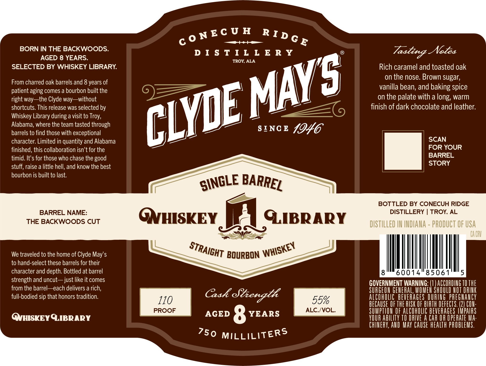

# TTB COLA Label Images - TTBID 26125001000443

**Brand Name:** CLYDE MAY'S

**Issue Date:** 05/12/2026

**Origin Code:** 10

**Product Class/Type:** 101

**Source:** [TTB Public COLA Registry](https://ttbonline.gov/colasonline/viewColaDetails.do?action=publicFormDisplay&ttbid=26125001000443)

## Label Images

### Label 1

### Label 2

## Extracted Label Text

*Text extracted via OCR - may contain errors*

*1 image(s) excluded: text did not meet readability threshold*

**Detected Proof:** 110
**Detected Age:** 8 Years

### Label 1

BORN IN THE BACKWOODS:
D I $ T I L L E R y
Notea
AGED 8 YEARS.
TROY, ALA
SELECTED BY WHISKEY LIBRARY
Rich caramel and toasted oak
on the nose Brown sugar;
From charred oak barrels and 8 years of
patient aging comes a bourbon built the
vanilla bean; and baking spice
right way
the Clyde way
~without
on the palate with a
warm
shortcuts: This release was selected by
finish of dark chocolate and leather:
Whiskey Library during a visit to
Alabama; where the team tasted through
barrels to find those with exceptional
SINC E
1046
character  Limited in quantity and Alabama
SCAN
finished, this collaboration isn't for the
FOR YOUR
timid. It's for those who chase the
BARREL
STORY
stuff; raise a little hell, and know the best
bourbon is built to last.
BOTTLED BY CONECUH RIDGE
BARREL NAME:
DISTILLERY
TROY; AL
THE BACKWOODS CUT
QNHISKEY
QIBRARY
DISTILLED IN INDIANA
PRODUCT OF USA
CA CHU
We traveled to the home of Clyde May'$
BOURBON
to hand-select these barrels for their
character and depth: Bottled at barrel
60014
85061
5
strength and uncut ~ just like it comes
GOVERNMENT WARNING: (1 ) ACCOHDIUG TO The
from the barrel  each delivers a rich;
SURGEOH GE_ehaL; WOMER Should HOT DRIK
full-bodied sip that honors tradition.
110
Caxk dbenoth
55%
AlCohOLIc  BEVERAGES DuRIG pREGHAUCY
BECAUSe OF THE HISK OF bIRTH DEFECTS (2) COU:
PROOF
AGED
8
YEARS
ALC./VOL:
SuMPTIOU OF AlcohOLC beVEHAGES IMPAIRS
QVHISKEY QIBRARY
YOUR ability TO DRIVE A CAR OR OPERATe Ma:
ChIHERY, ALD May CauSe health prOblems:
MILLILITERS
C 0 NE C U H
R Id G E
Tastind -
MAYS
CLYE
long;
Troy;
good
SINGLE
BARREL
STRAIGHT
WHISKEY
750
