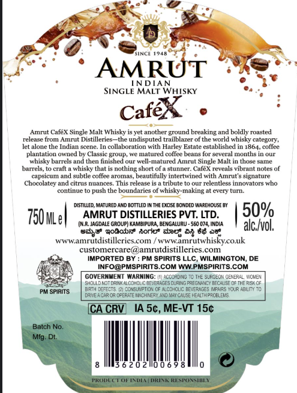
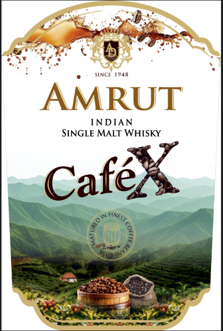

# TTB COLA Label Images - TTBID 26125001000529

**Brand Name:** AMRUT

**Issue Date:** 07/22/2026

**Origin Code:** 5I

**Product Class/Type:** 118

**Source:** [TTB Public COLA Registry](https://ttbonline.gov/colasonline/viewColaDetails.do?action=publicFormDisplay&ttbid=26125001000529)

## Label Images

### Label 1

### Label 2

## Extracted Label Text

*Text extracted via OCR - may contain errors*

### Label 1

FNCT
Iah
AMRUT
NDIAN
SINGLE MALT WHISKY
Cafex
Amnit
CafeX Single Malt Whisky
yet annther ground breaking and boldly roasted
Feleaze Tom Amnr
Distilleries_the undisputed trailblazer of the world whisky category,
let alone the Indian scene. In collaboration with Harley Estate established in 1864, coffee
planlalion owued by Classic group
malured coffee beans for sereral mOnlhs
whisky barrels and then finished our well-matured
HTuI
Malt in those sae
hatrele
craft a whisky that
nothing short of & stunner. CafeX reveals vibrant notes
capsicum and
suhtle coffee aromas, beautifully intertwined with Amrut'$ signature
Chocolatey
citruis nuances
This Felease is a tribute
relentless innovators
conlulie
push the boundaries of whiskv-making
eventuru
DiSILEL
MatureD AND BOTTLED
THE EXCISE BONDED IA REHOUSE BY
750MLe|
AMRUT DISTILLERIES PVT: LTD.
509
(NR: JAGDALE GROUPi KAMBIPURA, BENGALURU - 5e0 074, InDia
alc Ivol;
03388 gobabae borko" aes D 84 05
WWWamrutdistilleries Com
wwwamrutwhiskycouk
customercare @amrtdistilleries com
IMPORTED BY
PM SPIRITS LLC, WILMINGTON_
INFO@PMSPIRITS COM WWPMSPIRITS COM
GOVERNMEMT
HARHING_
ACOAdMc
Tre SLRSEON CENERAL MOne
Vtea
Ozacrscuzi' = prreuacy DeCae-
E7E
DchciizT 7
LColci^ Df 'reg-s iflis KIp ABilM
PM SPIRITS
Cupe cPLM
Cesehafen_a0
Caee hfbiAP A
[CA CRV
IA 5c, ME-VT 15c
Batch No.
Mfg. Dt:
6 2 0 2il0 0 6 9
EMUMUETUEIAM
Iteeta
Sinple -
Vbo

### Label 2

SINCE 1948
AMRUT
INDIAN
SINGLE MALT WHISKY
Cafex
