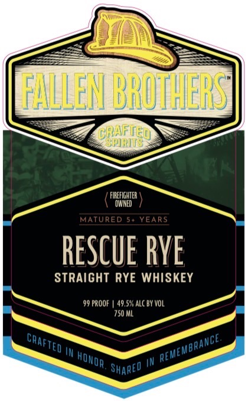
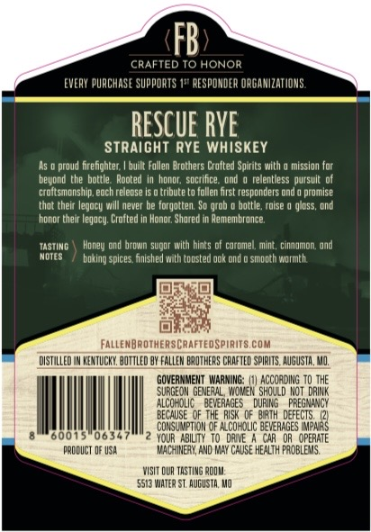

# TTB COLA Label Images - TTBID 26125001000648

**Brand Name:** FALLEN BROTHERS CRAFTED SPIRITS

**Fanciful Name:** RESCUE RYE 
STRAIGHT RYE WHISKEY

**Issue Date:** 05/12/2026

**Origin Code:** 29

**Product Class/Type:** 102

**Source:** [TTB Public COLA Registry](https://ttbonline.gov/colasonline/viewColaDetails.do?action=publicFormDisplay&ttbid=26125001000648)

## Label Images

### Label 1

### Label 2

### Label 3

## Extracted Label Text

*Text extracted via OCR - may contain errors*

**Detected Proof:** 99

### Label 1

FFALLEN BROMHERS
Orpiried
FIREfIGHTER
DMNED
MATURED 54 YEARS
RESCuE RYE
STRAIGHT RYE WHISKEY
99 PROOF
49,5% ALC BY VoL
750 ML
IN
Shared
~CRAFTEd
~REMEMBRANCE
HOwor .

### Label 2

NINJU
Hhs
0]
DNYUAMBMTU
Qauv5
FALLEN BROTHERST
CRAFTED
SPIRITS
SHARED
~REMEMBRANGE
TED
KANCE
REME
IJMYI

### Label 3

FB
CRAFTED T0 HONOR
EVERY PURCHASE Supports 15" RESPOMDER ORGAMIZAT IoNs .
RESCUE RYE
StrAiGHT RYE WhiSkey
proud firefighter
built Fallen Drothers Crafted Spirits with
mnission tor
beyond the   bottle   Nooted
hondt;  soctifce  ond
relentless  pursult of
croltsmonship, eoch reledse Is 0 tribute to follen fitst respondets ond @ promise
that their legocy will never be forgotten: So grob
bottie. rdise
gloss, ond
hondt their le gucy: Crofted In Honor; Shured In Hemembrunce:
TASTING
ond brown Sugpr wlth hints of curomel  mint , cinndmon; Ond
MdTEs
boklng splces; fnished Sth tousted gok ond
sidoth wotmth
FallenbrothersCrafteospirits Com
dISTLLEd
HENTUCKU, oTtled DY FALLEM BAOTHERS CRAFTED SpIRLTS. AGUSTA, MI,
GOVERMMEMT  WARMING;
ACCORdiNG T0 THE
SURGEDM GENERAL , WAdWEK Should WoT  dRIRK
AlcorDlIc
BEVERAGES
DURIRG
REGMANCY
BECAUSE   QF THE RUSK  of   bu3Th  DEFECTS,
05
COKSUMPTDM @F ALCOFDLIC beVERAGES [Mpa=
600
0634
YOUR   AbIlY  Todane
OR   OPERATE
pzddUCT DF USA
WACMIMERN, ANd RaAY ChuSE HEALTH FRDBLEMS
WISLT QUA TASTING Rodm
5513 VaTE? ST AugUSTA Mo
Heney
