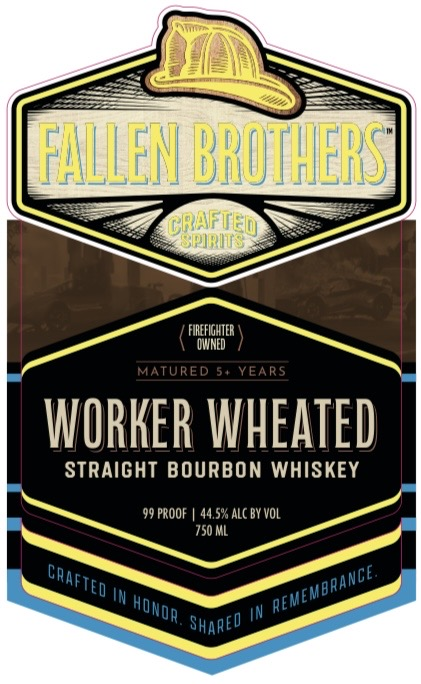
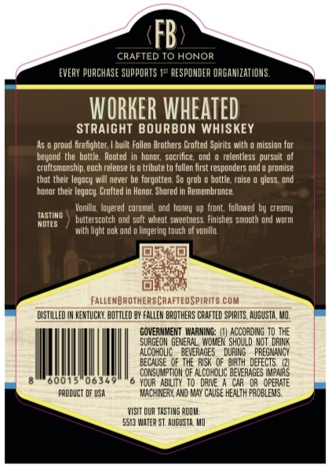

# TTB COLA Label Images - TTBID 26125001000682

**Brand Name:** FALLEN BROTHERS CRAFTED SPIRITS

**Fanciful Name:** WORKER WHEATED 
STRAIGHT BOURBON WHISKEY

**Issue Date:** 05/12/2026

**Origin Code:** 29

**Product Class/Type:** 101

**Source:** [TTB Public COLA Registry](https://ttbonline.gov/colasonline/viewColaDetails.do?action=publicFormDisplay&ttbid=26125001000682)

## Label Images

### Label 1

### Label 2

### Label 3

## Extracted Label Text

*Text extracted via OCR - may contain errors*

**Detected Proof:** 99

### Label 1

EALLENBROHERS
Orhified
FirefIgHTER
DMNED
MATURED
5+ YEARS
WORKER Vheated
StRAIGHT BOURBON WHISKEY
99 PROOF
44.5% ALC BY VOL
750 ML
In
IN
crAfted
ance.
~REMEMBR/
HOwor
Shareo

### Label 2

NINJU
Hhs
0]
DNYUAMBMTU
Qauv5
FALLEN BROTHERST
CRAFTED
SPIRITS
SHARED
~REMEMBRANGE
TED
KANCE
REME
IJMYI

### Label 3

FB
CRAFTED T0 HONOR
EVERY PURCHASE Supports 15" RESPOMDER ORGAMIZAT IoMS
WORKER WHEATeD
StrAiGHT BOURBON WHISKEY
proud firefighter;
built Fallen Urothers Crafted Spirits with
Inission Tor
beyond the   bottle   Rooted
hondt; soctifce  ond
relentless  pursult of
croltsmonship, eoch reledse
tribute E
follen fitst respondets ond @ promise
that thelr legocy will never be forgotten: So grob
bottie . rdise
gloss; ond
hordt their Tegucy: Crofted In Honor; Shure d In Hemembrunce:
Vonillo , Iouered caromel Ond honey Up  Iront, followed by  credmy
TASTING
Mdtes
butterscotch und soft whedt smeetoess, Finishes Smooth ond WDIM
Mith Ight put dnd
lingering touch of wonllo
Fallenbrotherscrafteospirits Com
diSTuLLEdL
KENTUCKU, BOTtLEd OY FALLEM BAOTHERS CRAFTED SpIRLTS. AGUSTA, MZ,
GOVERMMEMT  WARNING;
ACCORdING T0 THE
SURGEDM GEVERAL , WdWEK should HoT  dRIRK
AlCOT DlIC
BEVERAGES
DURIRG
EGMANCY
BECAUSE   €F ThE RUSK  of   bu3Th  DEFECTS
COKSUMPTUDM OF ALCOFDLIC beVERAGES [Mpa
05
600
0634
YOUR   ABILY Todane
OR   OPERATE
pzoduCT DF USA
WACMIMERN, ANd RAY ChuSE HEALTH FADBLEMS
WISLT OuA TASTING Rodm
5543 MIATE? ST AugUSTA Wo
