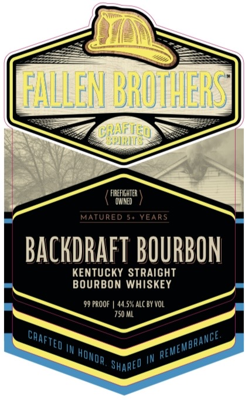
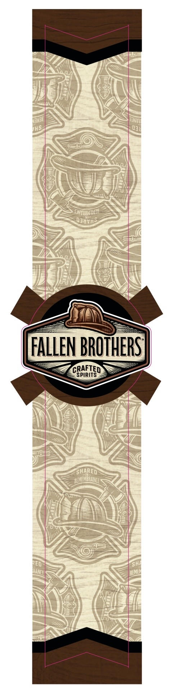
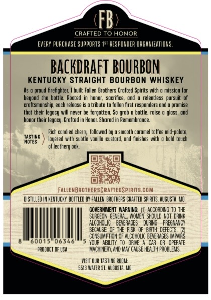

# TTB COLA Label Images - TTBID 26125001000691

**Brand Name:** FALLEN BROTHERS CRAFTED SPIRITS

**Fanciful Name:** BACKDRAFT BOURBON 
KENTUCKY STRAIGHT BOURBON

**Issue Date:** 05/12/2026

**Origin Code:** 29

**Product Class/Type:** 101

**Source:** [TTB Public COLA Registry](https://ttbonline.gov/colasonline/viewColaDetails.do?action=publicFormDisplay&ttbid=26125001000691)

## Label Images

### Label 1

### Label 2

### Label 3

## Extracted Label Text

*Text extracted via OCR - may contain errors*

**Detected Proof:** 99

### Label 1

FFALLEM BROMHERS
crhificed
FIREFIGHTER
DMNED
MATURED
5+ YEARS
backdrafT BOURBON
KenTUCKY Straight
BOURBON WHISKEY
99 PROOF
44,5% ALC BY VOL
750 ML
IN
IN
Shared
CRAFTEo
?ANCE.
FMbAA
~REMEA
HOwor

### Label 2

NINJU
Hhs
0]
DNYUAMBMTU
Qauv5
FALLEN BROTHERST
CRAFTED
SPIRITS
SHARED
~REMEMBRANGE
TED
KANCE
REME
IJMYI

### Label 3

FB
CRAFTED T0 HONOR
EVERY PUACHASE SuppORTS 1#" RESPONDER ORGA NIZATIOMS
BACKDrafT BOURBON
Kentucky Straight BOURbOn Whiskey
proud firefightec;
built Fallen Aroghers Cro fted Spurdes wilh
misslon For
beyond the bottle:
hondg; soctince  ond
relentless  pursule of
crqicsmons hpp. eoch feledse
tribulet
follen frst responders ond
promse
that theic  legocy
never be forgotten: So grob
bottle, roise
gloss; @nd
honor Eheir egocy: Crofted
Honor; Shared
Hemembluce;
Rich cundled chern; Follawed E
( SmooLh Curdmel toffee ld-polote;
IASIING
Idyered
subele  vonlud  Cuskord, ond 6mshes wch
bald  touch
Mdies
of Heaehegy ook
FAlleMBROTHERSCRAFTEDSPRITS COM
DISTILLED IM HENTUCKU, BOTTLEd OY FALLEM DAOTHERS CRAFTED SpIRLTS. AGUSTA, MZ,
GOVERNMEMT   WARNING:;
MA HV SGR? HG
TO THE
SURGE DM GENERAL
Should Wot  DRIK
AlCOKDLIC
BEVERAGES
DURIRG
PREGMANCY
BECAUSE  OF THE RISK   OF83th DEFECTS,
COKSU MPTLDM OF AlCorDLIC beVERAGES
0T648
600
0634
YDUR   ABIUTY To DRME
OR   OPERATE
produCT DF USA
WACMIMERN, AD RMY ChuSE HEALTH FzDBLEMS,
VISIT QUR TASTIMG Podm
5513 WnTe? ST  AuguSTA Wo
pocted
