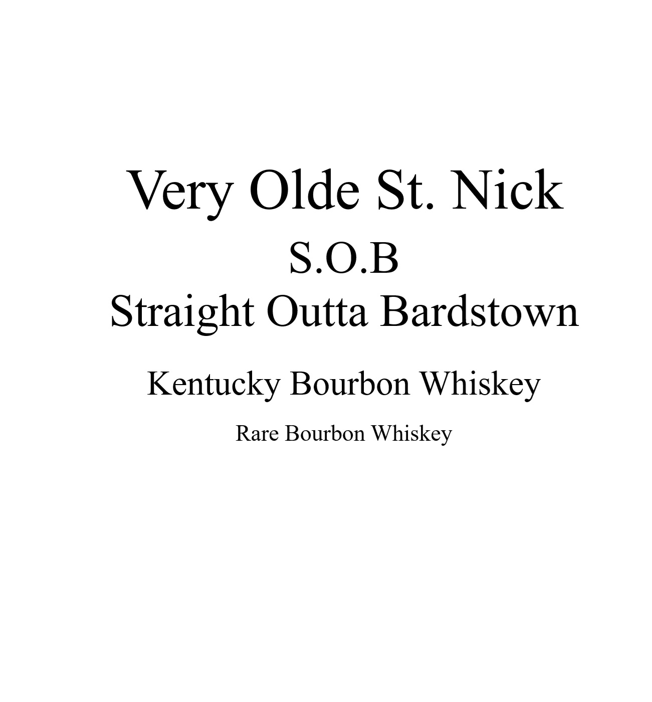
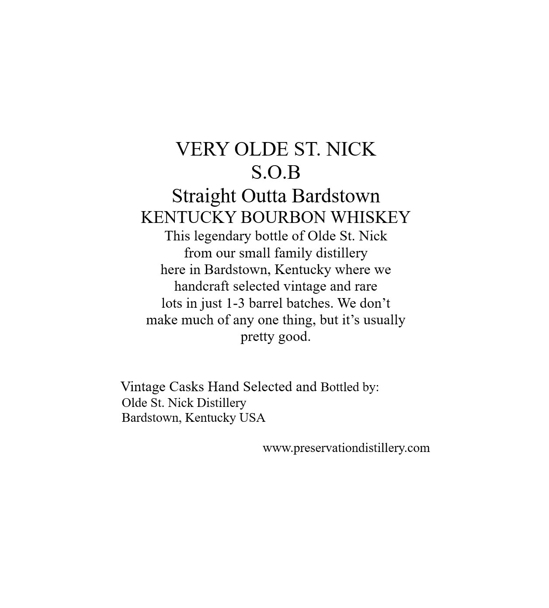
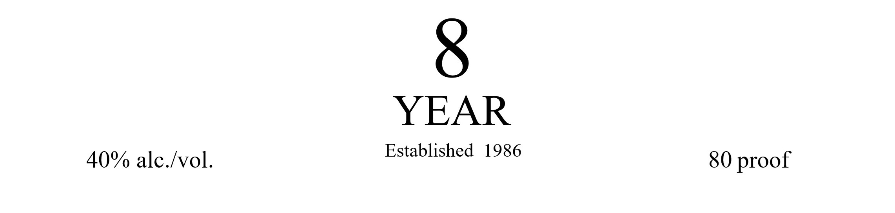

# TTB COLA Label Images - TTBID 26125001000761

**Brand Name:** VERY OLDE ST. NICK

**Issue Date:** 05/08/2026

**Origin Code:** 22

**Product Class/Type:** 101

**Source:** [TTB Public COLA Registry](https://ttbonline.gov/colasonline/viewColaDetails.do?action=publicFormDisplay&ttbid=26125001000761)

## Label Images

### Back Label

### Label 1

### Label 3

### Label 4

### Label 5

## Extracted Label Text

*Text extracted via OCR - may contain errors*

*1 image(s) excluded: text did not meet readability threshold*

### Back Label

Very Olde St. Nick

S.O.B

Straight Outta Bardstown

Kentucky Bourbon Whiskey

Rare Bourbon Whiskey

### Label 1

VERY OLDE ST NICK
S.OB
Straight Outta Bardstown
KENTUCKY BOURBON WHISKEY
This legendary bottle of Olde St: Nick
from our small family distillery
here in Bardstown, Kentucky where we
handcraft selected vintage and rare
lots in just 1-3 barrel batches
We don t
make much of any one
but it' s usually
pretty
Vintage Casks Hand Selected and Bottled by:
Olde St: Nick Distillery
Bardstown, Kentucky USA
www:preservationdistillery.com
thing,
good.

### Label 4

GOVERNMENT WARNING:
ACCORDING
TO
THE
SURGEON
GENERAL
INGmeR) AGSORDH
NOT
DRINK
ALcOHOLic
BEVERAGES
DURiNG
PREGNANCY
BECAUSE
OF
THE
RISK
OF
BIRTH
DEFFECTS
CONSUMpTION
OF
Alcoholic
BEVERAGES
IMPAIRS
YOUR
ABILITY
TO
DRIVE
A
CAR OR
OPERATE
MACHINERK
ANd
MAY
CAUSE
HEALTH
PROBLEMS.
UPC- FOR POSITION ONLY
750ML

### Label 5

Barrel Number:

Private Barrel Pick for:

1234

A.B.C. Wine & Spirits
