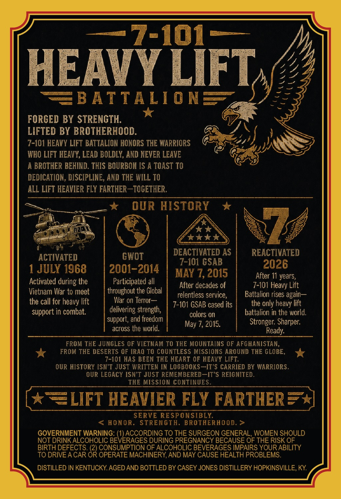
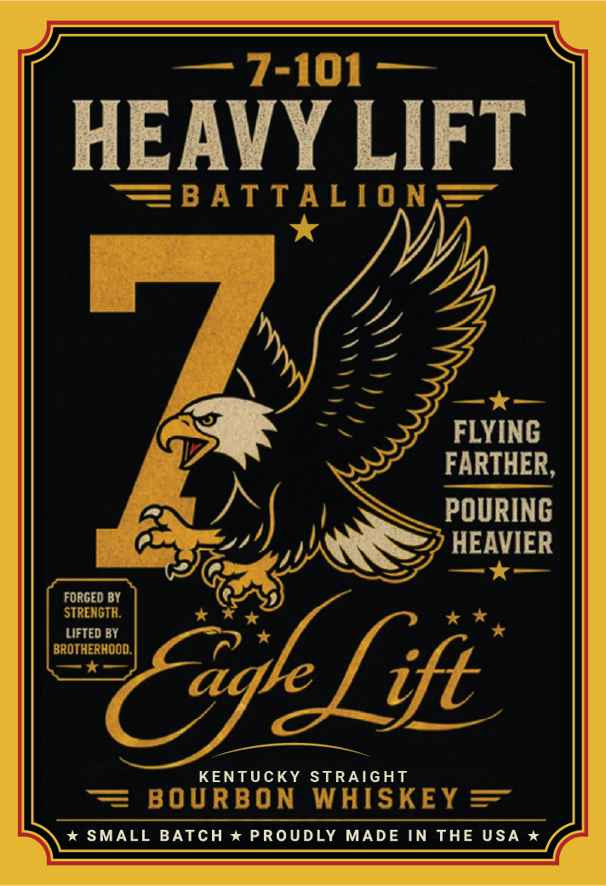
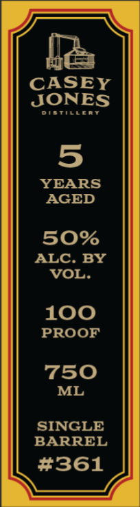

# TTB COLA Label Images - TTBID 26125001000868

**Brand Name:** 7-101 HEAVY LIFT BATTALION

**Issue Date:** 05/13/2026

**Origin Code:** 22

**Product Class/Type:** 101

**Source:** [TTB Public COLA Registry](https://ttbonline.gov/colasonline/viewColaDetails.do?action=publicFormDisplay&ttbid=26125001000868)

## Label Images

### Back Label

### Front Label

### Label 2

## Extracted Label Text

*Text extracted via OCR - may contain errors*

**Detected Proof:** 100
**Detected Age:** 11 Years

### Back Label

7-101
HEAVY LIFT
B ATTA LI0 NE
FORGED BY STRENGTH.
LIFTED BY BROTHERHOOD.
7-101 HEAVY LIFT BATTALION HONORS THE WARRIORS
WHO LIFT HEAVY, LEAD BOLDLY, AND NEVER LEAVE
A BROTHER BEHIND: THIS BOURBON IS A TOAST TO
DEDICATION , DISCIPLINE, AND THE WILL TO
ALL LIFT HEAVIER FLY FARTHER  ~TOCETHER,
OUR HISTORY
Xxr*
ACTIVATED
GWOT
DEACTIVATED AS
REACTIVATED
7-101 GSAB
2026
1 JULY 1968
2001-2014
MaY 7, 2015
After 11 years,
Activated during the
Participated all
After decades of
7-101 Heavy Lift
Vietnam War to meet
throughout the Global
relentless service,
Battalion rises again
the call for heavy lift
War on Terror
7-101 GSAB cased its
the only
lift
support in combat.
delivering strength;
colors on
battalion in the world,
support; and freedom
May 7, 2015.
Stronger; Sharper
across the world,
Ready:
FROM THE JUNGLES OF VIETNAM TO THE MOUNTAINS OF AFGHANISTAN,
FROM THE DESERTS OF [RAQ TO COUNTLESS MISSIONS AROUND THE GLOBE,
7-101 HAS BEEN THE HEART OF HEAVY LIFT:
OUR HISTORY [SN'T JUST WRITTEN IN LOGBOOKS-IT'S CARRIED BY WARRIORS .
OUR LEGACY ISN'T JUST REMEMBERED-IT'S REIG NITED .
THE MISSION CONTINUES.
LIFT HEAVIER FLY FARTHER
SERVE RESPONSIBLY
HONOR.
STRENGTH. BROTHERHOOD.
GOVERNMENT WARNING: (1) ACCORDING TO THE SURGEON GENERAL, WOMEN SHOULD
NOT DRINK ALCOHOLIC BEVERAGES DURING PREGNANCY BECAUSE OF THE RISK OF
BIRTH DEFECTS: (2) CONSUMPTION OF ALCOHOLIC BEVERAGES IMPAIRS YOUR ABILITY
TO DRIVEA CAR OR OPERATE MACHINERY, AND MAY CAUSE HEALTH PROBLEMS
DISTILLED IN KENTUCKY AGED AND BOTTLED BY CASEY JONES DISTILLERY HOPKINSVILLE, KY
heavy

### Front Label

7-101
HEAVY LIFT
FBATTALIO N
FLYINC
FARTHER,
POURING
HEAVIER
FORGED BY
STRENGTH.
LIFTED BY
BROTHERHOOD
aql fift
KENTUCKY STRAIGHT
BO U RB O N
WHISKEY
SMALL BATCH
*PROUDLY
MADE IN THE USA *

### Label 2

CASEY

JONES

DieTitueRy

YEARS

AGED

O%

ALC. BY

VOL.

100

PROOF

750

ML

SINGLE

BARREL

#361
