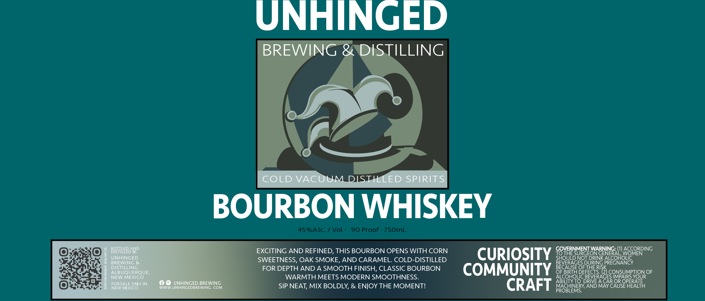

# TTB COLA Label Images - TTBID 26125001000882

**Brand Name:** UNHINGED BREWING & DISTILLING

**Issue Date:** 05/11/2026

**Origin Code:** 34

**Product Class/Type:** 101

**Source:** [TTB Public COLA Registry](https://ttbonline.gov/colasonline/viewColaDetails.do?action=publicFormDisplay&ttbid=26125001000882)

## Label Images

### Label 1

## Extracted Label Text

*Text extracted via OCR - may contain errors*

**Detected Proof:** 90

### Label 1

UNHINGED
BREWING &DISTILLING
COLD VACUUM DIST
ED SPIRITS
BOURBON WHISKEY
45%Alc:
Vol
90 Proof
75OmL
BOTTLEED ND
EXCITING AND REFINED, THIS BOURBON OPENS WITH CORN
CURIOSITY S8HER3N61E3A8WCorolocorpinG
1
BREHWGGD
SWEETNESS, OAK SMOKE, AND CARAMEL. COLD-DISTILLED
BEORIEGESDDRNG PREOHOvcy
RLSTQUERQUE,
FOR DEPTH AND A SMOOTH FINISH, CLASSIC BOURBON
COMMUNITY #8
BEG1RISH DEFECE RIS2) CONSUMPTION OF
1
NEW MEXICO
WARMTH MEETS MODERN SMOOTHNESS.
ALCOHOLIC BEVERAGES IMPAIRS YOUR
FORSALE ONLY IN
UNHINGED BREWING
ABILITY TO DRIVE A CAR OR OPERATE
NEW MEXICO
WNWW UNHINGEDBREWING: COM
SIP NEAT; MIX BOLDLY, & ENJOY THE MOMENTI
CRAFT
MACHINERY; AND MAY CAUSE HEALTH
PROBLEMS
