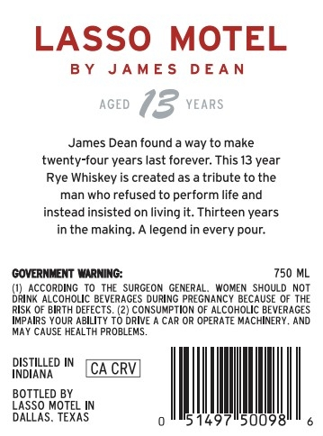
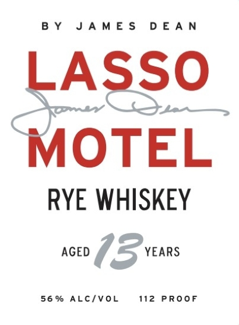

# TTB COLA Label Images - TTBID 26125001000900

**Brand Name:** LASSO MOTEL

**Fanciful Name:** AGED 13

**Issue Date:** 05/11/2026

**Origin Code:** 44

**Product Class/Type:** 102

**Source:** [TTB Public COLA Registry](https://ttbonline.gov/colasonline/viewColaDetails.do?action=publicFormDisplay&ttbid=26125001000900)

## Label Images

### Back Label

### Front Label

## Extracted Label Text

*Text extracted via OCR - may contain errors*

**Detected Proof:** 112
**Detected Age:** 13 Years

### Back Label

LASSO
MOTEL
B Y
JA ME $
D EA N
AGED
73 YEARs
James Dean found
way to make
twenty-four years last forever: This 13 year
Rye Whiskey
created as
tribute to the
man who refused to perform life and
instead insisted on living it: Thirteen years
in the making_
legend in every pour:
GOVERNMENT WARNING:
750 ML
AcCORDING
To THE SURGEON GENERAL:
WOMEN SHOULD NOT
DRInk ALcOHOLIc BEVERAGES DURing PREGNANCY BECAUSE 0F THE
RISK OF BIRTH DEFECTS: (2) coNSUMPTION OF ALCOHOLIC BEVERAGES
IMPAIRS YOUR ABILITY TO DRIVE
CAR OR OPERATE MACHINERY
AND
MaY CAUSE HEALTH PROBLEMS_
DVSTHED =
CA CRVI
BOTTLED BY
LaSSO MOTEL IN
DALLAS. TEXAS
1497
50098

### Front Label

BY JAMES DEAN

OTEL
OTEL
RYE WHISKEY

AGED (5 ve08s

56% ALC/VOL 112 PROOF
