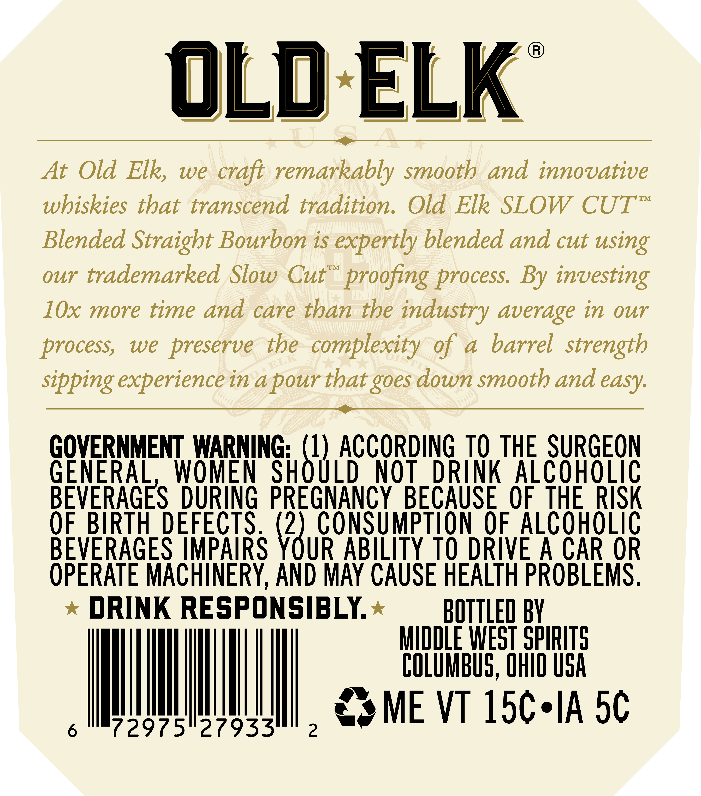
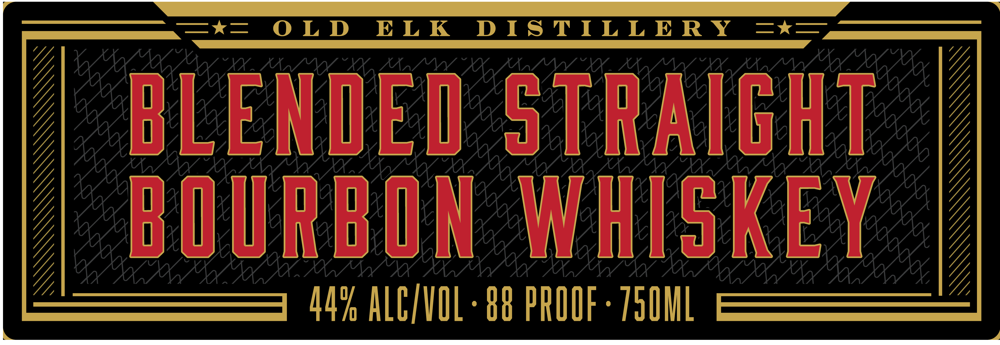

# TTB COLA Label Images - TTBID 26125001000947

**Brand Name:** OLD ELK

**Issue Date:** 05/11/2026

**Origin Code:** 09

**Product Class/Type:** 121

**Source:** [TTB Public COLA Registry](https://ttbonline.gov/colasonline/viewColaDetails.do?action=publicFormDisplay&ttbid=26125001000947)

## Label Images

### Back Label

### Front Label

### Label 4

## Extracted Label Text

*Text extracted via OCR - may contain errors*

*1 image(s) excluded: text did not meet readability threshold*

**Detected Proof:** 88

### Back Label

oLd ELK
At Old Elk,
we
craft remarkably smooth
and innovative
TM
wbiskies that transcend tradition.
Old Elk SLOW
CUT
Blended Straight Bourbon is expertly blended and cut using
our trademarked Slow
Cut"
proofing process  By investing
lOx more time and care than the industry average in Our
process;
we
preserve the complexity %f a
barrel strength
sipping experience in apour that _
down smooth and
GOVERNMENT WARNING; (1) ACCORDING TO THE SURGEON
GENERAL
WOMEN
SHOULD
NOT
DRINK Alcoholic
BEVERAGES DURING PREGNANCY
BECAUSE  OF  THE RISK
OF BIRTH_DEFECTS (2) consumptION %f ALCOHOLIC
BEVERAGES IMPAIRS YOUR ABILITY TO DRIVE A CAR OR
OPERATE MACHINERY, AND MAY CAUSE HEALTH PROBLEMS.
DRINK RESPONSIBLY
BOTTLED BY
MiddLE WEST SPIRITS
COLUMBUS, OHIO uSA
ME VT 15c*IA 5c
72975"27933
2
ELE
goes
easy:

### Front Label

Ata eeeraeremrarereergrerreearrecerara MATA
DLENUED STRAIGHT
| BUURBON WHISKEY |
[2 AY, ALC/VOL + 88 PROOF - 750ML Z
