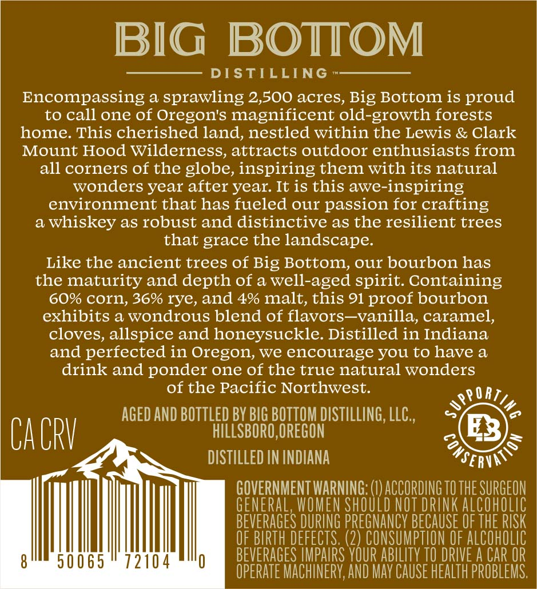
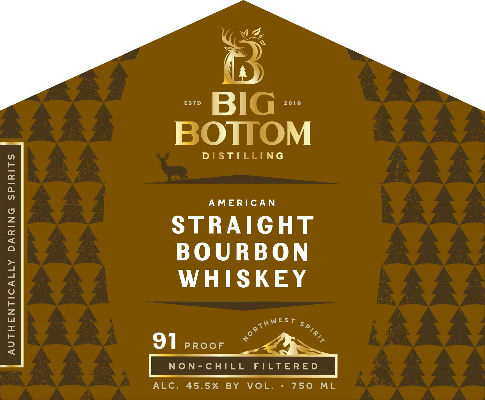

# TTB COLA Label Images - TTBID 26125001000953

**Brand Name:** BIG BOTTOM DISTILLING

**Fanciful Name:** AMERICAN STRAIGHT BOURBON

**Issue Date:** 06/02/2026

**Origin Code:** 38

**Product Class/Type:** 101

**Source:** [TTB Public COLA Registry](https://ttbonline.gov/colasonline/viewColaDetails.do?action=publicFormDisplay&ttbid=26125001000953)

## Label Images

### Back Label

### Label 1

## Extracted Label Text

*Text extracted via OCR - may contain errors*

**Detected Proof:** 91

### Back Label

BD), BD),
IG BOTTOM
——- DISTILLING »————_-
Encompassing a sprawling 2,500 acres, Big Bottom is proud
to call one of Oregon's magnificent old-growth forests
home. This cherished land, nestled within the Lewis & Clark
Mount Hood Wilderness, attracts outdoor enthusiasts from
all corners of the globe, inspiring them with its natural
wonders year after year. It is this awe-inspiring
environment that has fueled our passion for crafting
a whiskey as robust and distinctive as the resilient trees
that grace the landscape.
Like the ancient trees of Big Bottom, our bourbon has
the maturity and depth of a well-aged spirit. Containing
60% corn, 36% rye, and 4% malt, this 91 proof bourbon
exhibits a wondrous blend of flavors—vanilla, caramel,
cloves, allspice and honeysuckle. Distilled in Indiana
and perfected in Oregon, we encourage you to have a
drink and ponder one of the true natural wonders
of the Pacific Northwest. OR
wey
AGED AND BOTTLED BY BIG BOTTOM DISTILLING, LLC, <= °
( i CRY HILLSBORO, OREGON 3 =
Z DISTILLED IN INDIANA USERS
GOVERNMENT WARNING: (1) ACCORDING 10 THE SURGEON
GENERAL, WOMEN SHOULD NOT DRINK ALCOHOLIC
BEVERAGES DURING PREGNANCY BECAUSE OF THE RISK
OF BIRTH DEFECTS. (2) CONSUMPTION OF ALCOHOLIC
PLL TTITRI PSTPMLLLTI GEVERAGES IMPAIRS YOUR ABILITY TO DRIVE A CAR OR
OPERATE MACHINERY, AND MAY CAUSE HEALTH PROBLEMS.

### Label 1

ESTD
BIG
20[0
BOTTOM
DISTILLING
1
AMERIC AN
1
STRAIGHT
BOU RBON
1
WHISKEY
1
91
PROoF
NON-chILL
FILTERE D
ALc.
45.5 %
BY
VoL.
750
ML
noRThWEST
SPTRTT
