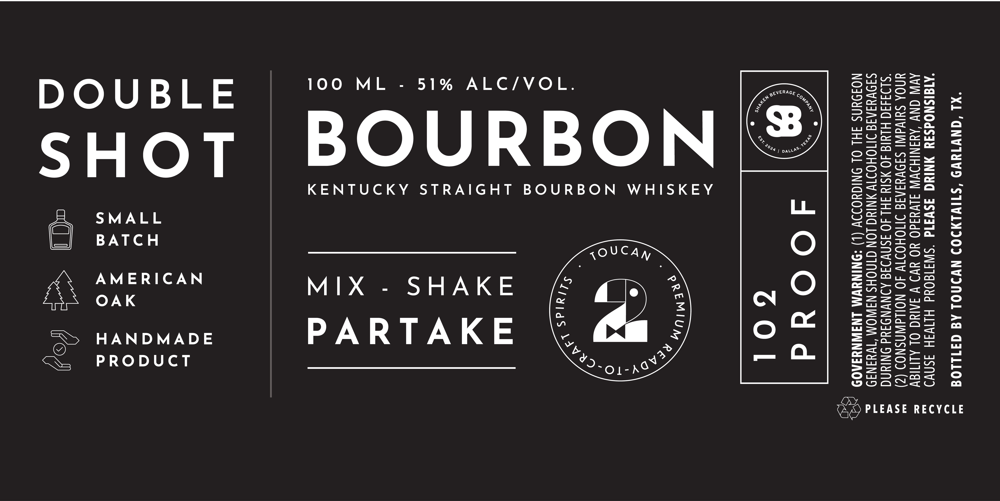

# TTB COLA Label Images - TTBID 26126001000386

**Brand Name:** TOUCAN

**Issue Date:** 07/02/2026

**Origin Code:** 44

**Product Class/Type:** 101

**Source:** [TTB Public COLA Registry](https://ttbonline.gov/colasonline/viewColaDetails.do?action=publicFormDisplay&ttbid=26126001000386)

## Label Images

### Label 1

## Extracted Label Text

*Text extracted via OCR - may contain errors*

### Label 1

"XL ONW1TEV5 “STIVLNIOD NVINOL AG GI11LO9

"AISISNOdS3Y NING 3SW3I1d ‘SWIIGONd HIIVIH ISNVD
AVI GNV ‘AYINIHDVW JIVYSd0 YO MVD V JANG OL ALITISY
YNOA SHIVA SIDVYIAI DIIOHOIIV 40 NOILdASNOD (2)
'$194440 HLUIG 40 S14 FHL 40 ISNVIIG AINVNDIYd ONIUNG
SIDVYIAI JITIOHOITV YNING LON GINOHS NIWOM ‘TWYINID
NOJOUNS JHL OL ONIGUODIV (L) “ONINYWM LNIWNYIAOD 2

PLEASE RECYCLE

(7)
e
“
“»
2,
024

>

LL

YZ

Tr

=

Zz

O
yj (ad
‘OO:
> co
SM: jew

UU
-™|: |<3%
— = L
. . YY —_
_Q: a

=)

- <
smi isa
: e >a
LL fm ;
m O +z 5 23

UW
oor is 2s f:
O nm <tO La
OAV) Gs
