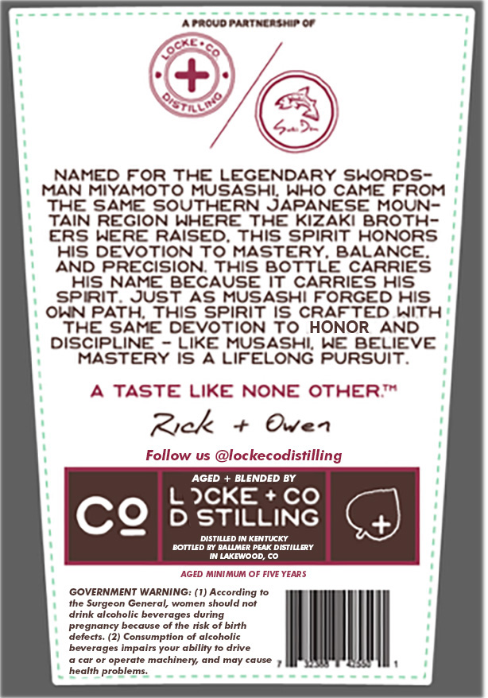
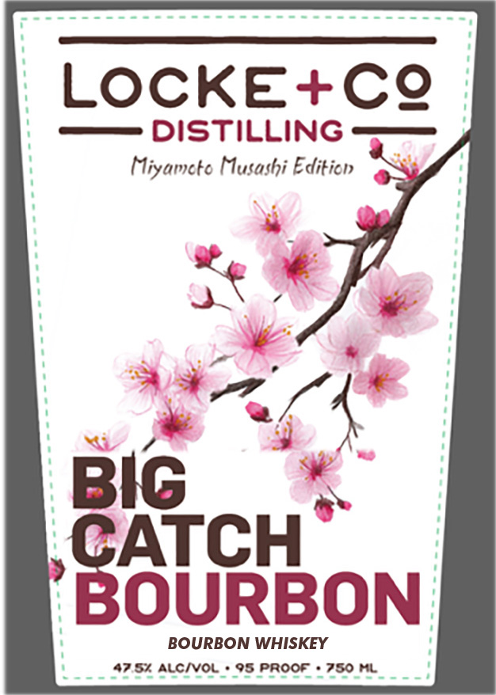

# TTB COLA Label Images - TTBID 26126001000423

**Brand Name:** LOCKE + CO DISTILLING

**Issue Date:** 05/27/2026

**Origin Code:** 13

**Product Class/Type:** 141

**Source:** [TTB Public COLA Registry](https://ttbonline.gov/colasonline/viewColaDetails.do?action=publicFormDisplay&ttbid=26126001000423)

## Label Images

### Back Label

### Front Label

## Extracted Label Text

*Text extracted via OCR - may contain errors*

### Back Label

Frcudtailat
crt
54
NAMED For ThE LECENDARY Shords-
MAN MIYAMOTO
Fas 98855
Who CAME FROM
THE SAME SoutheRn
MOUN-
TAIN REGION WHERE
THE Kizaki Broth-
ERs WeRE RAISED;
This spirit HONORS
His DEVoTION To MASTERY
BALANCE
AND PRECISION
ThIS BOTTLE CARRIES
His NAME BECAUSE It CARRIES His
Spirit
JUsT As MUSASHI FORGED His
OKN PATH this Spirit Is CRAFTED With
THE SAME DEVOTION To HONOR
AND
DISCiPLINE
LikE MUSASHL We BELIEVE
MASTERY Is A LIFELONG Pursuit.
TASTE LikE
NONE OTHERT
Zyck
0ven
Follow us @lockecodistilling
AGED
BLENDED BY
JCKE
Co
CQ
D STILLING
DISTILLED IN KENTUCKY
BOTTUD BY RALLMER PEAK DISTILLERY
Ui Liglood
AGED MINIMUM OF FIVE YEARS
GOVERNMENT WARNING: (1) According to
the Surgeon General, women should not
drink alcoholic beverages during
pregnancy because of the risk
birth
defects _
(2) Consumption
alcoholic
beverages impairs your ability to drive
car or operate machinery and may cause
health problems.

### Front Label

eee enn eee eee san aases

LOCKE +CQ

Miyameto Musashi Edit

xe é

Vat

$30Bibon

BOURBON WHISKEY

< Saves rcueeeccocvenaress ‘

fol PROOF SO ML
