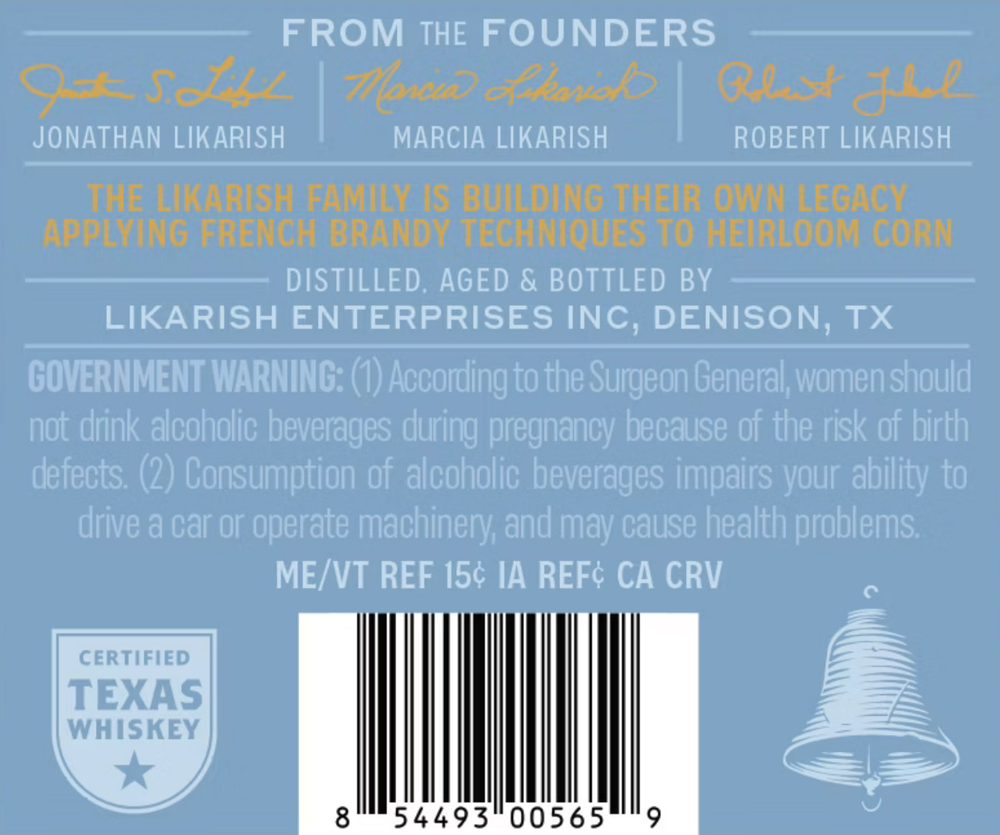
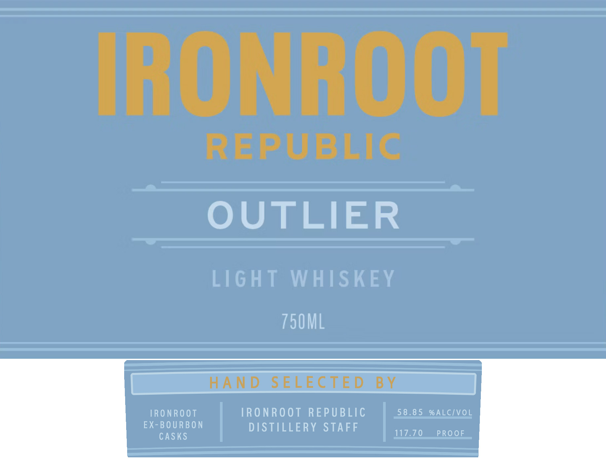

# TTB COLA Label Images - TTBID 26126001000547

**Brand Name:** IRONROOT OUTLIER

**Issue Date:** 05/12/2026

**Origin Code:** 44

**Product Class/Type:** 144

**Source:** [TTB Public COLA Registry](https://ttbonline.gov/colasonline/viewColaDetails.do?action=publicFormDisplay&ttbid=26126001000547)

## Label Images

### Back Label

### Front Label

## Extracted Label Text

*Text extracted via OCR - may contain errors*

**Detected Proof:** 117.7

### Back Label

FROM THE FOUNDERS
Oeadell
7onc) eante{5
O2
JONATHAN LIKARISH
MARCIA LIKARISH
ROBERT LIKARISH
THE:LKARISHAEAMLNAIS BUDANG UHEURAONLEGAG
AppENTNG FRENOH BRYNDY TECHNTQUES TO:HeTRLOOM CORN:
DISTILLED; AGED & BOTTLED BY
LIKARISH ENTERPRISES INC, DENISON; TX
GOVERNMENT WARNING: (0) Accordling to the Surgeon General; womenshould
not drink alcoholic beverages
pregnancy because of the risk of birth`
defects; (2) Consumption of alcoholic beverages impairs your ability to
drive & car Or
operate machinery;and may cause health problems;
MEIVT REF 154 IA REFc CA CRV
CERTIFIED
TEXAS
WHISKEY
8
54493"00565
9
d
during

### Front Label

IRONROOT
REPUBLIG
OUTLIER
LIG H T
W HISKEY
750ML
H A N D
S ELE C TE D
B V
TRO NRO OT
TRO NROOT REPUBLIC
5,8_8 5_%ALCIVOL
EX-BOURBON
DISTILLERY STAFF
casks
117.70
PROOF
