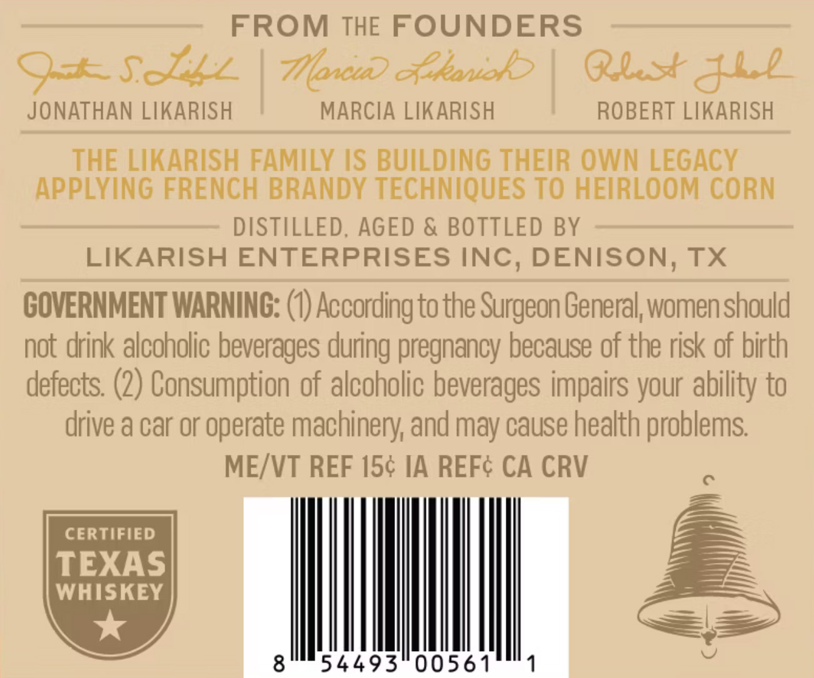
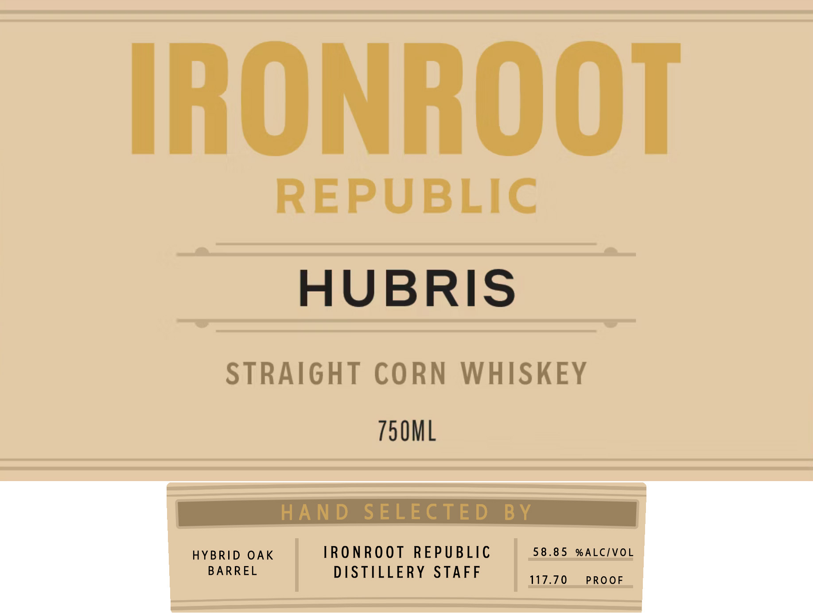

# TTB COLA Label Images - TTBID 26126001000553

**Brand Name:** IRONROOT HUBRIS

**Issue Date:** 05/12/2026

**Origin Code:** 44

**Product Class/Type:** 103

**Source:** [TTB Public COLA Registry](https://ttbonline.gov/colasonline/viewColaDetails.do?action=publicFormDisplay&ttbid=26126001000553)

## Label Images

### Back Label

### Front Label

## Extracted Label Text

*Text extracted via OCR - may contain errors*

**Detected Proof:** 117.7

### Back Label

FROM THE FOUNDERS
9+SzZ
7oncuD cxkanob
Ql+&2
JONATHAN LIKARISH
MARCIA LIKARISH
ROBERT LIKARISH
THE LIKARISH FAMILY IS BUildinG THEIR OWN LEGACY
APPLYING FRENCH BRANDY TECHNIQUES TO HEIRLOOM CORN
DISTILLED
AGED & BOTTLED BY
LIKARISH ENTERPRISES INC, DENISON, TX
GOVERNMENT WARNING: (0) According to the Surgeon General, women should
not drink alcoholic beverages
pregnancy because of the risk of birth
defects: (2) Consumption of alcoholic beverages impairs your ability to
drive a car or operate machinery; and may cause health problems
MEIVT REF 154 IA REFC CA CRV
CERTIFIED
TEXAS
WHISKEY
8
54493"00561
1
during

### Front Label

IRONROOT

REPUBLIC
HUBRIS

STRAIGHT CORN WHISKEY
750ML

ARREL DISTILLERY STAFF

HYBRID OAK IRONROOT REPUBLIC 58.85 %ALC/VOL
gaan 117.70 PROOF
