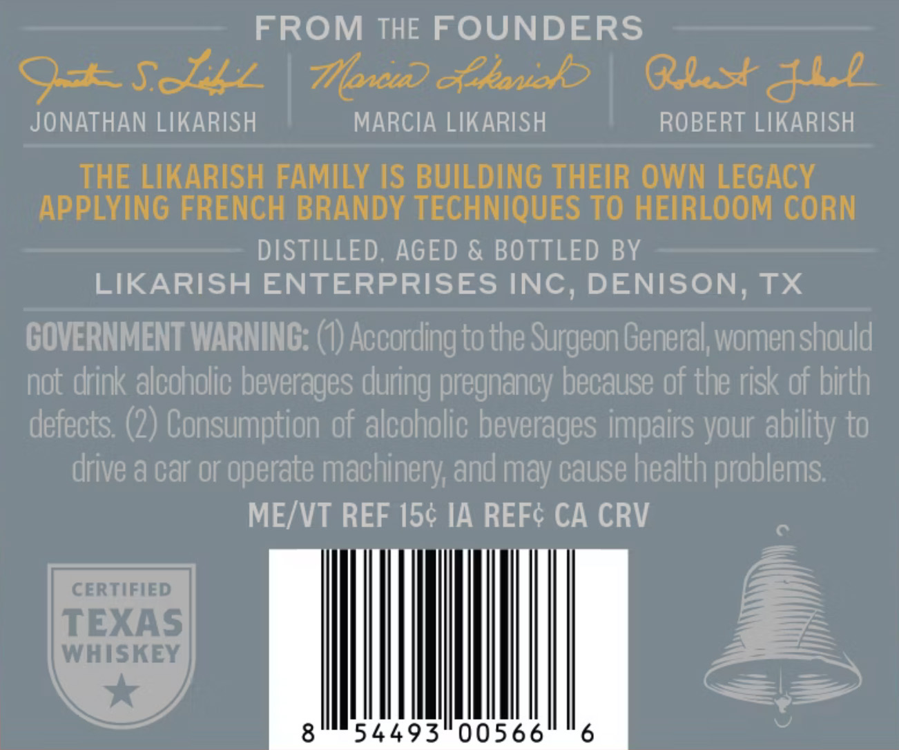
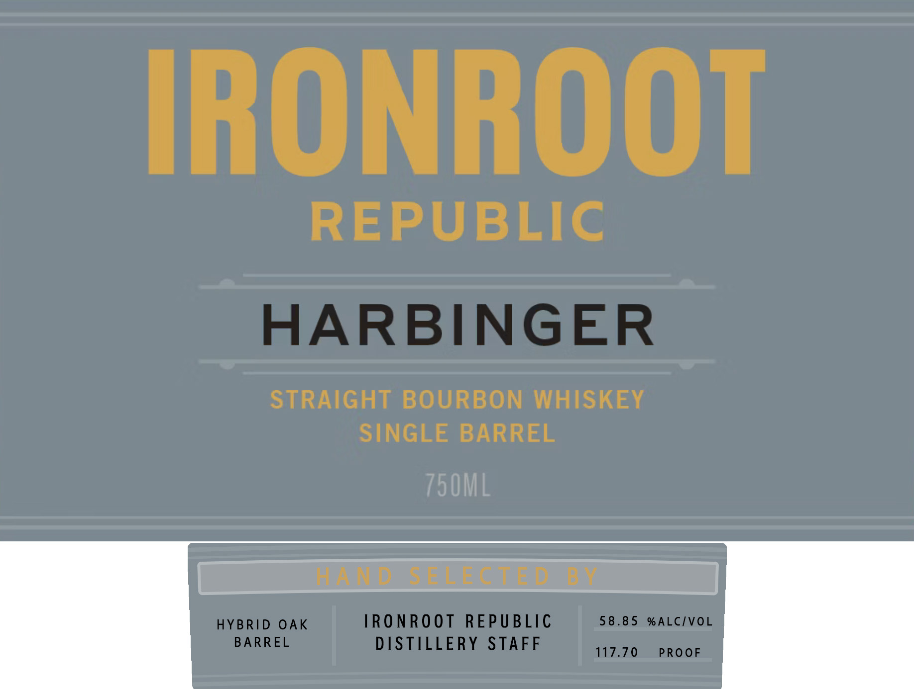

# TTB COLA Label Images - TTBID 26126001000556

**Brand Name:** IRONROOT HARBINGER SINGLE BARREL

**Issue Date:** 05/12/2026

**Origin Code:** 44

**Product Class/Type:** 141

**Source:** [TTB Public COLA Registry](https://ttbonline.gov/colasonline/viewColaDetails.do?action=publicFormDisplay&ttbid=26126001000556)

## Label Images

### Back Label

### Front Label

## Extracted Label Text

*Text extracted via OCR - may contain errors*

**Detected Proof:** 117.7

### Back Label

FROM THE FOUNDERS
GA SALL | Wow havik? | Blast GLb
JONATHAN LIKARISH MARCIA LIKARISH ROBERT LIKARISH
THE LIKARISH FAMILY IS BUILDING THEIR OWN LEGACY
APPLYING FRENCH BRANDY TECHNIQUES TO HEIRLOOM CORN
DISTILLED, AGED & BOTTLED BY
LIKARISH ENTERPRISES INC, DENISON, TX
GOVERNMENT WARNING: (1) According to the Surgeon General, women should
not drink alcoholic beverages during pregnancy because of the risk of birth
defects. (2) Consumption of alecholic beverages impairs your ability to
drive a car or operate machinery, and may cause health problems
ME/VT REF 15¢ IA REF¢ CA CRV =
CERTIFIED f
TEXAS 7
WHISKEY A ——>
ges 4493'00566" 6

### Front Label

IRONROOT
REPUBLIC
HARBINGER
STRAIGHT BOURBON WHISKEY
SINGLE BARREL
750ML
d
SEEe
1
HYBRID OAK
TRO NROoT
REPUBLIC
58 . 8 5
% ALCIVOL
BARREL
DISTILLERY
STAFF
117.70
PROOF
