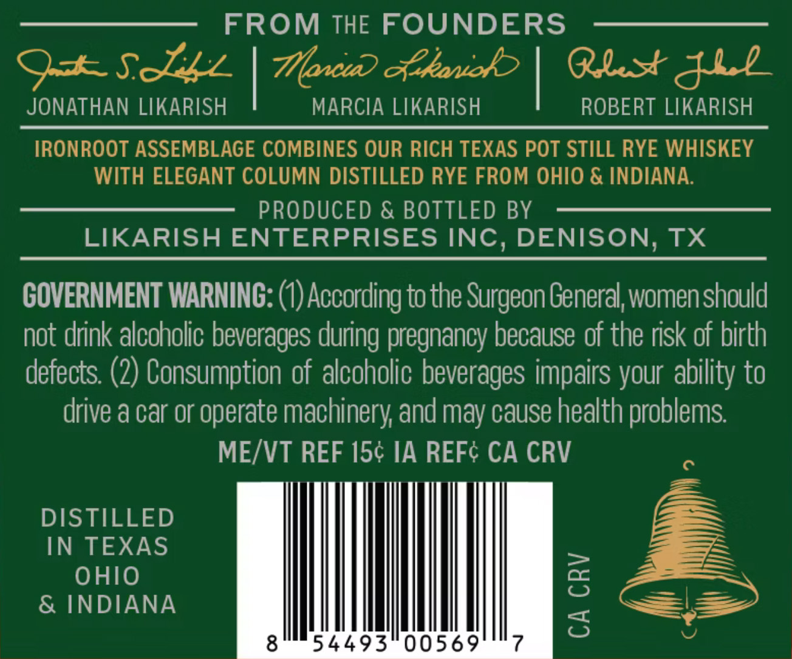
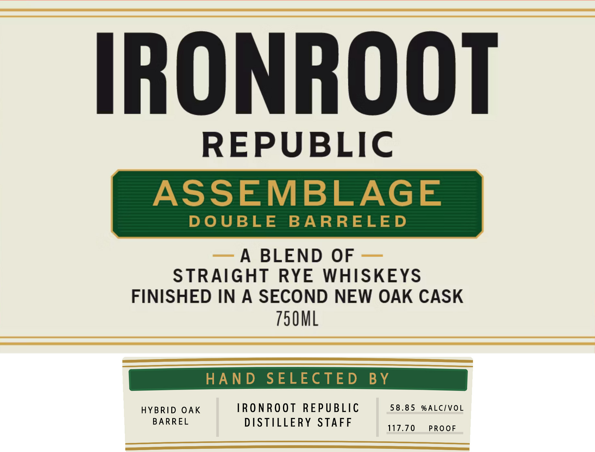

# TTB COLA Label Images - TTBID 26126001000558

**Brand Name:** IRONROOT ASSEMBLAGE RYE DOUBLE BARREL

**Issue Date:** 05/12/2026

**Origin Code:** 44

**Product Class/Type:** 122

**Source:** [TTB Public COLA Registry](https://ttbonline.gov/colasonline/viewColaDetails.do?action=publicFormDisplay&ttbid=26126001000558)

## Label Images

### Back Label

### Front Label

## Extracted Label Text

*Text extracted via OCR - may contain errors*

**Detected Proof:** 117.7

### Back Label

FROM THE FOUNDERS
9+SJzz
Foci) &kanob
Qlst&l2
JONATHAN LIKARISH
MARCIA LIKARISH
ROBERT LIKARISH
IRONROOT ASSEMBLAGE COMBINES OUR RICH TEXAS POT STILL RYE WHISKEY
WITH ELEGANT COLUMN DISTILLED RYE FROM OHIO & INDIANA
PRODUCED & BOTTLED BY
LIKARISH ENTERPRISES INC, DENISON, TX
COVERNMENT WARNING: (0) According to the Surgeon General; womenshould
not drink alcoholic beverages during pregnancy because of the risk of birth
defects: (2) Consumption of alcoholic beverages impairs your ability to
drive a car or operate machinery and may cause health problems
ME/VT REF 15c IA REFC CA CRV
DISTILLED
IN TEXAS
OHIO
8
& INDIANA
3
8
54493"00569
7

### Front Label

REPUBLIC
ASSEMBLAGE
DOUBLE BARRELED
A BLEND OF
STRAIGHT RYE WHISKEYS
FINISHED IN A SECOND NEW OAK CASK
750ML
HAND sELecteD By
HYBRID OAK IRONROOT REPUBLIC 58.85 %ALC/VOL
BARREL DISTILLERY STAFF LTO _PROwE
