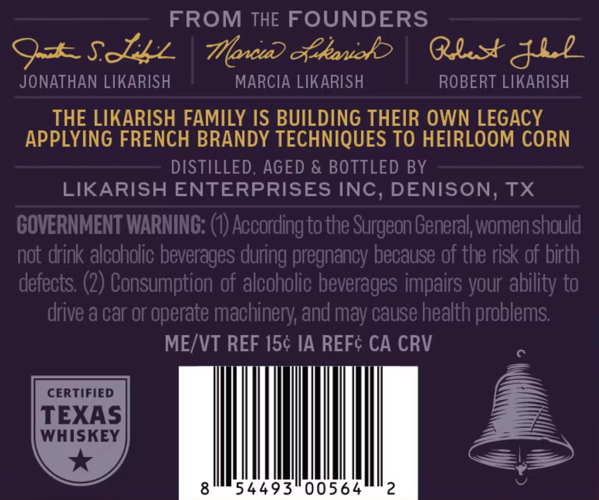
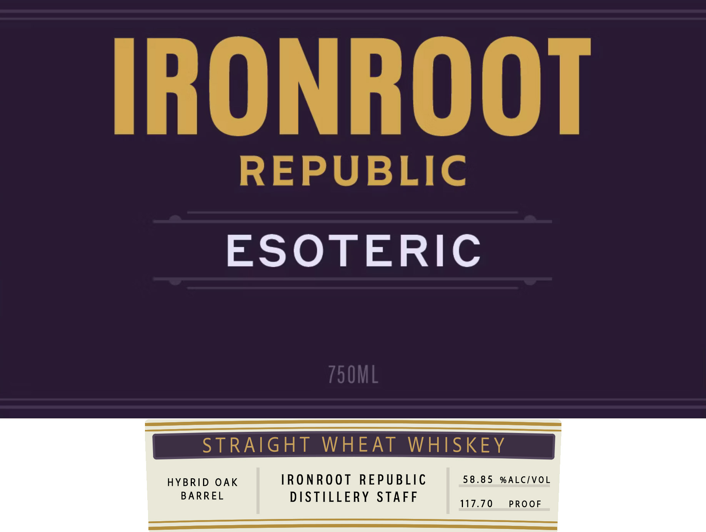

# TTB COLA Label Images - TTBID 26126001000560

**Brand Name:** IRONROOT ESOTERIC WHEAT

**Issue Date:** 05/12/2026

**Origin Code:** 44

**Product Class/Type:** 109

**Source:** [TTB Public COLA Registry](https://ttbonline.gov/colasonline/viewColaDetails.do?action=publicFormDisplay&ttbid=26126001000560)

## Label Images

### Back Label

### Front Label

## Extracted Label Text

*Text extracted via OCR - may contain errors*

**Detected Proof:** 117.7

### Back Label

FROM THE FOUNDERS
9+SJzz
Tonu) cekanob
Qlst&ll
JONATHAN LIKARISH
MARCIA LIKARISH
ROBERT LIKARISH
THE LIKARISH FAMILY IS BUILDING THEIR OWN LEGACY
APPLYING FRENCH BRANDY TECHNIQUES TO HEIRLOOM CORN
DISTILLED; AGED & BOTTLED BY
LIKARISH ENTERPRISES INC, DENISON, TX
GOVERNMENT WARNING: (0) According tothe Surgeon General women should
not drink alcoholic beverages
pregnancy because of the risk of birth
defects: (2) Consumption of alcoholic beverages impairs your ability to
drive & car or operate machinery; and may cause health problems
MEJVT REF 154 IA REFc CA CRV
CERTIFIED
TEXAS
WHISKEY
8
54493
00564
2
during

### Front Label

IRONROOT
REPUBLIC
ESOTERIC
750ML
STRAIGHT
WHEAT
WHISKEY
HYBRID OAK
IRONROot REPUBLIC
58 . 8 5
% ALCIVOL
BARREL
DISTILLERY
STAFF
117.70
PROOF
