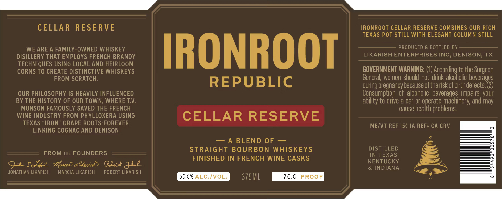

# TTB COLA Label Images - TTBID 26126001000573

**Brand Name:** IRONROOT CELLAR RESERVE

**Issue Date:** 05/22/2026

**Origin Code:** 44

**Product Class/Type:** 121

**Source:** [TTB Public COLA Registry](https://ttbonline.gov/colasonline/viewColaDetails.do?action=publicFormDisplay&ttbid=26126001000573)

## Label Images

### Label 1

## Extracted Label Text

*Text extracted via OCR - may contain errors*

**Detected Proof:** 120

### Label 1

CELLAR
RESERVE
IRONROOT CELLAR RESERVE COMBINES OUR RICH
TEXAS POT STILL WITH ELEGANT COLUMN STILL
WE ARE A FAMILY-OWNED WHISKEY
IRONROOT
PRODUCED & BOTTLED BY
DISILLERY THAT EMPLOYS FRENCH BRANDY
LIKARISH ENTERPRISES INC, DENISON, TX
TECHNIQUES USING LOCAL AND HEIRLOOM
CORNS TO CREATE DISTINCTIVE WHISKEYS
COVERNMENT WARNING:
According to the
FROM SCRATCH:
General; women should not drink alcoholic beverages
REPUBLIC
during pregnancybecause oftheriskof birthdefects (2)
OUR PHILOSOPHY IS HEAVILY INFLUENCED
Consumption  of  alcoholic   beverages impairs  your
BY THE HISTORY OF OUR TOWN, WHERE TV:
ability to drive a car or operate machinery; and may
MUNSON FAMOUSLY SAVED THE FRENCH
cause health problems
WINE INDUSTRY FROM PHYLLOXERA USING
CELLAR
RESERVE
TEXAS
IRON" GRAPE ROOTS-FOREVER
MEVT REF 154 IA REFC CA CRV
LINKING COGNAC AND DENISON
A BLEND
OF
STRAIGHT BOURBON WHISKEYS
DISTILLED
FROM THE FOUNDERS
IN TEXAS
FINISHED IN FRENCH WINE CASKS
KENTUCKY
9-sdz
Toxu) &koniob
Q2x
& INDIANA
JONATHAN LIKARISH
MARCIA LIKARISH
ROBERT LIKARISH
60.0% ALC /VOL:
375ML
120.0
PROOF
Surgeon
J42
