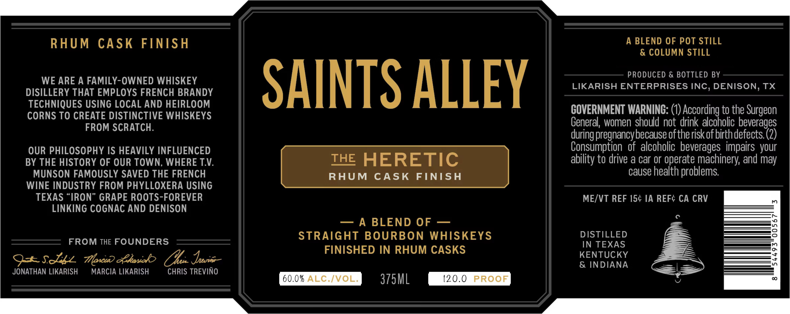

# TTB COLA Label Images - TTBID 26126001000577

**Brand Name:** SAINTS ALLEY

**Fanciful Name:** HERETIC

**Issue Date:** 05/22/2026

**Origin Code:** 44

**Product Class/Type:** 121

**Source:** [TTB Public COLA Registry](https://ttbonline.gov/colasonline/viewColaDetails.do?action=publicFormDisplay&ttbid=26126001000577)

## Label Images

### Label 1

## Extracted Label Text

*Text extracted via OCR - may contain errors*

**Detected Proof:** 120

### Label 1

RHUM
CAsk
FINISH
A BLEND OF POT STILL
& COLUMN STILL
PRODUCED & BOTTLED BY
WE ARE A FAMILY-OWNED WHISKEY
SAINTS ALLEY
LIKARISH ENTERPRISES INC, DENISON, TX
DISILLERY THAT EMPLOYS FRENCH BRANDY
TECHNIQUES USING LOCAL AND HEIRLOOM
COVERNMENT WARNING: (1) According to the
CORNS TO CREATE DISTINCTIVE WHISKEYS
FROM SCRATCH.
General; women should not drink alcoholic beverages
Ipregnancybecause oftheriskof birthdefects (2)
OUR PHILOSOPHY IS HEAVILY INFLUENCED
Consumption   of  alcoholic beverages impairs your
BY THE HISTORY OF OUR TOWN, WHERE TV:
THE HERETIC
ability to drive a car or operate machinery; and may
MUNSON FAMOUSLY SAVED THE FRENCH
RHUM
CASK
FINISH
cause health problems
WINE INDUSTRY FROM PHYLLOXERA USING
TEXAS
IRON" GRAPE ROOTS-FOREVER
ME/VT REF 154 IA REFC CA CRV
LINKING COGNAC AND DENISON
A
BLEND OF
4
0
STRAIGHT BOURBON
WHISKEYS
DISTILLED
FROM THE FOUNDERS
IN TEXAS
FINISHED IN RHUM CASKS
KENTUCKY
9-sdzz
Tonu) ckaniok
Oka Ibeorne
& INDIANA
JONATHAN LIKARISH
MARCIA LIKARISH
CHRIS TREVINO
60.0% ALC /VOL:
375ML
120.0
PROOF
Surgeon
duringe
