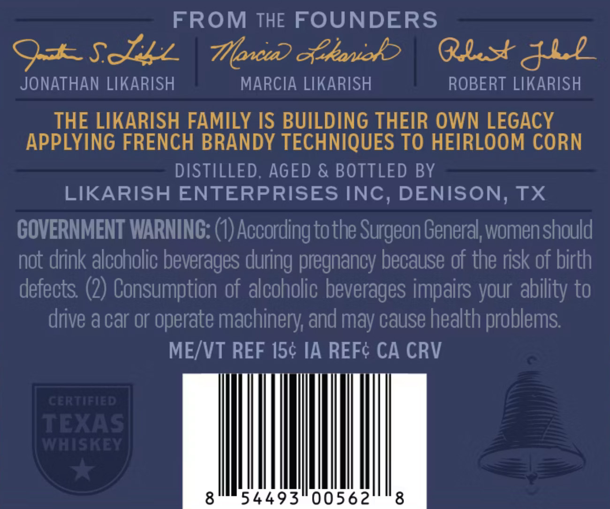
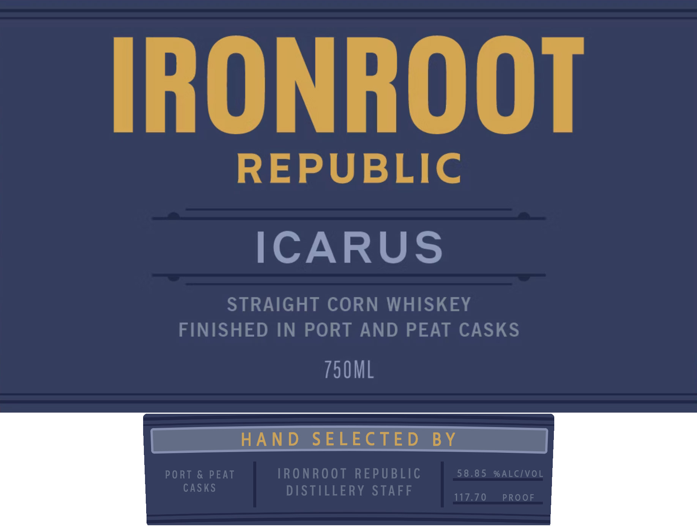

# TTB COLA Label Images - TTBID 26126001000589

**Brand Name:** IRONROOT ICARUS

**Issue Date:** 05/13/2026

**Origin Code:** 44

**Product Class/Type:** 103

**Source:** [TTB Public COLA Registry](https://ttbonline.gov/colasonline/viewColaDetails.do?action=publicFormDisplay&ttbid=26126001000589)

## Label Images

### Back Label

### Front Label

## Extracted Label Text

*Text extracted via OCR - may contain errors*

**Detected Proof:** 117.7

### Back Label

FROM THE FOUNDERS
9+SJzz
Howi &kawok
Qlsjll
JONATHAN LIKARISH
MARCIA LIKARISH
ROBERT LIKARISH
THE LIKARISH FAMILY IS BUILDING THEIR OWN LEGACY
APPLYING FRENCH BRANDY TECHNIQUES TO HEIRLOOM CORN
DISTILLED; AGED & BOTTLED BY
LIKARISH ENTERPRISES INC, DENISON, TX
GOVERNMENT WARNING: (0) According tothe Surgeon General women should
not drink alcoholic beverages
pregnancy because of the risk of birth
defects (2) Consumption of alcoholic beverages impairs your
to
drive a car or
operate machinery; and may cause health problems
MEIVT REF 1Sc IA REFc CA CRV
CERTIFIAD
TEXAS
WWNHISKEY
8
54493
00562
8
during
ability `

### Front Label

IRONROOT
REPUBLIC
ICARUS
STRAIGHT CORN WHISKEY
FINISHED IN PORT
AND PEAT CASKS
750ML
HA N D
SELECTE D
B Y
PO RT & PEAT
TRO NROOT REPUBLIC
58.8 5
% ALCIVOL
caskS
DISTILLERY STAFF
117.70
PROOF
