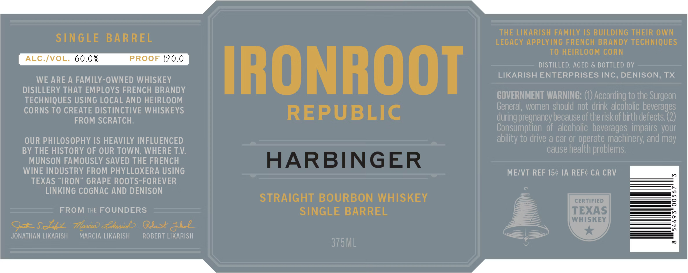

# TTB COLA Label Images - TTBID 26126001000593

**Brand Name:** IRONROOT HARBINGER 375

**Issue Date:** 05/12/2026

**Origin Code:** 44

**Product Class/Type:** 101

**Source:** [TTB Public COLA Registry](https://ttbonline.gov/colasonline/viewColaDetails.do?action=publicFormDisplay&ttbid=26126001000593)

## Label Images

### Label 1

## Extracted Label Text

*Text extracted via OCR - may contain errors*

**Detected Proof:** 120

### Label 1

THE LIKARISH FAMILY [S BUILDiNG THEIR OWN
STN GLE
BAR REL
LEGACY APPLYING FRENCH BRANDY TECHNIQUES
To HEIRLOOM CORN
ALC /VOL: 60.0 %
PROOF 120.0
DISTILLED; AGED & BOTTLED BY
WE ARE A FAMILY-OWNED WHISKEY
IRONROOT
LIKARISH ENTERPRISES INC, DENISON; TX
DISILLERY THAT EMPLOYS FRENCH BRANDY
TECHNIQUES USING LOCAL AND HEIRLOOM
COVERNMENT WARNING:
According to the Surgeon
CORNS TO CREATE DISTINCTIVE WHISKEYS
REPUBLIC
General, women should not drink alcoholic beverages
FROM SCRATCH:
pregnancy because of the riskof birth defects (2)
Consumption of  alcoholic beverages impairs your
OUR PHILOSOPHY IS HEAVILY INFLUENCED
ability to drive & car or operate machinery; and may
BY THE HISTORY OF OUR TOWN, WHERE TV:
cause health problems.
MUNSON FAMOUSLY SAVED THE FRENCH
HARBINGER
WINE INDUSTRY FROM PHYLLOXERA USING
ME/VT REF 154 IA REF& CA CRV
TEXAS
'IRON" GRAPE ROOTS-FOREVER
LINKING CogNAC AND DENISON
STRAIGHT BOURBON WHISKEY
CERTIFIED
3
FROM THE FOUNDERS
SINGLE BARREL
TEXAS
WHISKEY
9#.S8
Toncu? efkoniob QUs&l
JONATHAN LIKARISH
MARCIA LIKARISH
ROBERT LIKARISH
375ML
during [
