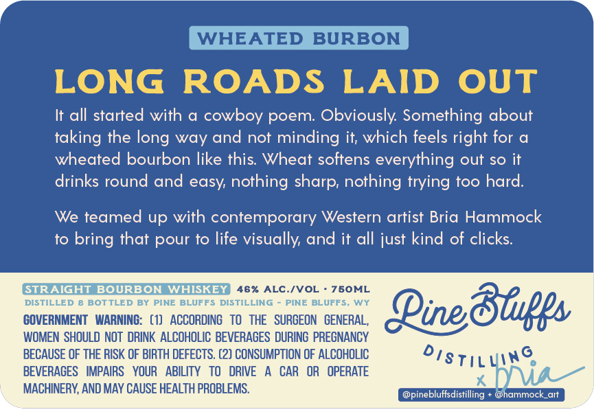
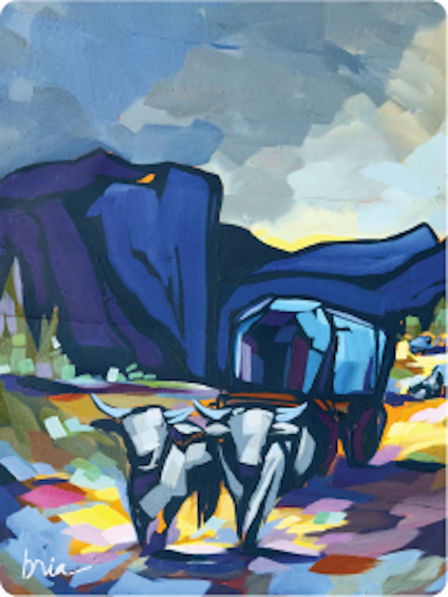

# TTB COLA Label Images - TTBID 26126001000810

**Brand Name:** PINE BLUFFS DISTILLING

**Fanciful Name:** WHEATED BOURBON

**Issue Date:** 05/12/2026

**Origin Code:** 49

**Product Class/Type:** 101

**Source:** [TTB Public COLA Registry](https://ttbonline.gov/colasonline/viewColaDetails.do?action=publicFormDisplay&ttbid=26126001000810)

## Label Images

### Back Label

### Front Label

### Label 2

## Extracted Label Text

*Text extracted via OCR - may contain errors*

*2 image(s) excluded: text did not meet readability threshold*

**Detected Proof:** 92

### Back Label

WHEATED
BURBON
LONG
ROADS
LAID
OUT
It all started with a cowboy poem: Obviously: Something about
taking the long way and not minding it; which feels right for &
wheated bourbon like this Wheat softens everything out so it
drinks round and easy nothing sharp; nothing trying too hard:
We teamed up with contemporary Western artist Bria Hammock
to bring that pour to life visually and it all just kind of clicks:
STRAIGHT
BOURBON WHISKEY
46%
ALC /VOL
750ML
DISTILLED
BOTTLED BY
PINE BLUFFS
DISTILLING
PINE BLUFFS_
WY
86p1
GOVERNMENT   WARNING:   (1)   ACCORDING   To  THE   SURGEON   GENERAL,
Pinec
WOMEN SHOULD NOT  DRINK ALCOHOLIC BEVERAGES DURING PREGNANCY
BECAUSE OF THE RISK OF BIRTH DEFECTS. (2) CONSUMPTION OF ALCOHOLIC
BEVERAGES   IMPAIRS
YOUR
ABILITY   TO   DRIVE
CAR
OR
OPERATE
distilunga_
MACHINERY, AND MAY CAUSE HEALTH PROBLEMS.
(@hammock_ait
@pinebluffsdistilling
