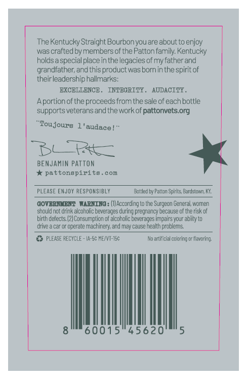
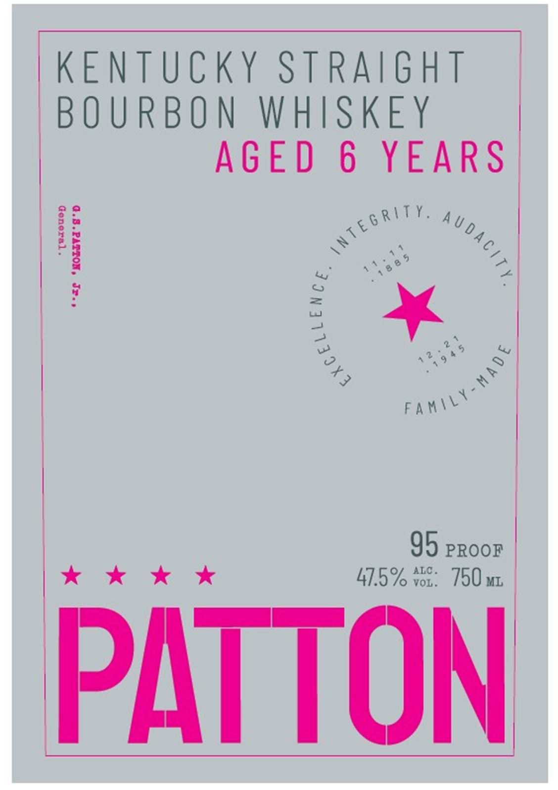

# TTB COLA Label Images - TTBID 26126001000847

**Brand Name:** PATTON

**Issue Date:** 06/01/2026

**Origin Code:** 22

**Product Class/Type:** 101

**Source:** [TTB Public COLA Registry](https://ttbonline.gov/colasonline/viewColaDetails.do?action=publicFormDisplay&ttbid=26126001000847)

## Label Images

### Back Label

### Label 1

## Extracted Label Text

*Text extracted via OCR - may contain errors*

**Detected Proof:** 82
**Detected Age:** 6 Years

### Back Label

The Kentucky Straight Bourbonyouare about to enjoy
was crafted by members of the Patton family. Kentucky
holasa specialplaceinthe legacies of myfather and
grandlather; and this proauct was bornin the
 spiritof
theirleadership hallmarks:
EXCELLENCE
INTEGRTTY_
AODACTTY .
Aportion ofthe proceeds from the sale of each bottle
supports veteransand theworkof pattonvets org
'Toujours
audace
BERt_
BENJaMiN Patton
pattonapirite
eom
PLEASE EMJOY RESPONSIBLY
Eattled bj Pattzn Spirits; Bardstovn;
GOVERNLEENT
VARNTNG : (IJAccording to Ine Surgecn General women
should not Crink alcoholic beverages
pregnancy Decause of the risk of
birth defects;
Consumption of alcoholic beverages impairs your abjity to
Cnve
cperate machinery; and may cause nealth problems
PLEASE RECYCLE _
IA-5c ME/VT-15c
No artificial coloring or flavoring;
60015"45620
Curing

### Label 1

KENTUCKY STRAIGHT

|

BOURBON WHISKEY

AGED 6 YEARS |

< ot)

Ay

FAW\Y

xkkwekk

41.0%

95 PROOF

750 ML

PATTON
