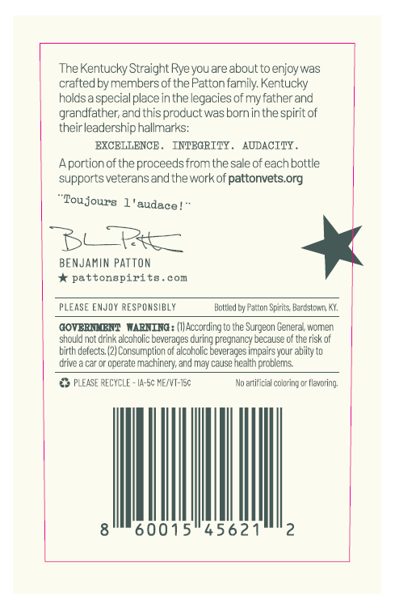
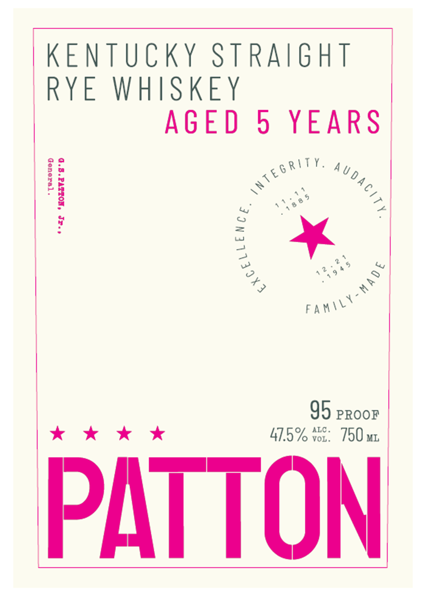

# TTB COLA Label Images - TTBID 26126001000850

**Brand Name:** PATTON

**Issue Date:** 06/01/2026

**Origin Code:** 22

**Product Class/Type:** 102

**Source:** [TTB Public COLA Registry](https://ttbonline.gov/colasonline/viewColaDetails.do?action=publicFormDisplay&ttbid=26126001000850)

## Label Images

### Back Label

### Label 1

## Extracted Label Text

*Text extracted via OCR - may contain errors*

**Detected Age:** 5 Years

### Back Label

The Kentucky Straight Ryeyou areabout to enjoy was
crafted by members of the Patton family. Kentucky
holasa specialplace in the legacies of my father and
grandfather; and thisprocuct was bornin the spiritof
theirleadership hallmarks:
EXCELTENCE
TNTEGRTTY
AUDACTTY .
Aportionofthe proccedsfrom the sale of cach bottle
supports veteransand theworkof pattonvets org
"Toujours 1 'audace
DC +t
BENJaMiN Patton
pattonapirits
eom
PLEASE EMJOY RESPOHSIBL"
Botted by Patton Spirits Bzre stzwn ^K
GOVERNLEENT
WARNTRG : (Il According to Ine Surgecn Cereral women
should nct Crina €
coholic beverages
pregnancy Decause cf the risk of
birth defects;
Consumption of alcok olic beverages impairs your abiity to
Cive a Car or @pcrate Machinery and may cause ncalth problem &
PLEASE RECYCLE _
I4-5c MEIV-I5c
No artificial coloring or flavoring;
60015"45621
Curing

### Label 1

KENTUCKY STRAIGHT
RYE WHISKEY
AGED 5 YEARS
1 Ss | “,
95 proor
x kkk 41.5% vor: 790 wm
