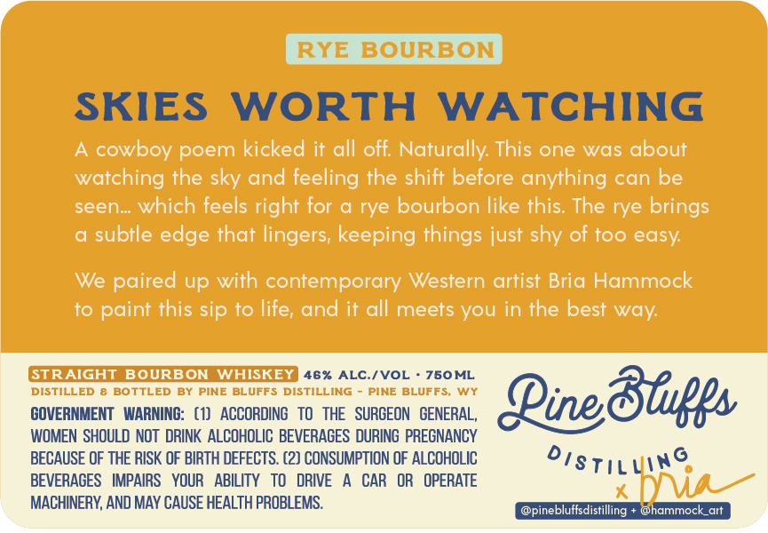
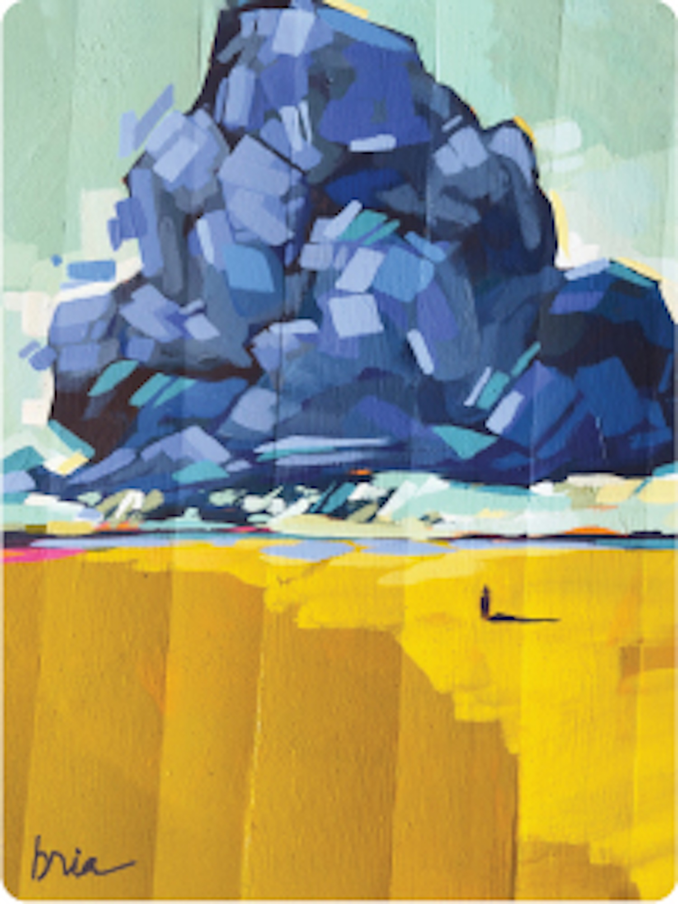

# TTB COLA Label Images - TTBID 26126001000864

**Brand Name:** PINE BLUFFS DISTILLING

**Fanciful Name:** RYE BOURBON

**Issue Date:** 05/12/2026

**Origin Code:** 49

**Product Class/Type:** 101

**Source:** [TTB Public COLA Registry](https://ttbonline.gov/colasonline/viewColaDetails.do?action=publicFormDisplay&ttbid=26126001000864)

## Label Images

### Back Label

### Front Label

### Label 3

## Extracted Label Text

*Text extracted via OCR - may contain errors*

*2 image(s) excluded: text did not meet readability threshold*

**Detected Proof:** 92

### Back Label

RYE BOURBON
SKIES
WORTH
WATCHING
cowboy poem kicked it all off: Naturally: This one was about
watching the sky and feeling the shift before anything can be
seen_ which feels right for
rye bourbon like this The rye brings
subtle edge that lingers; keeping things just shy of too easy:
We paired up with contemporary Western artist Bria Hammock
to paint this sip to life; and it all meets you in the best
GTRAIGHT
BOURBON
WHISKEY
46% ALC /VOL
760ML
DISTILLED
BOTTLED
PINE BLUFFS
DISTILLING
PINE BLUFFS
WY
3fues
COVERNMENT   WARNING:   (1)
ACCORDING   To   THE   SURCEON   GENERAL,
Qinec
WOMEN SHOULD NOT  DRINK  ALCOHOLIC BEVERACES DURING PRECNANCY
BECAUSE OF THE RISK OF BIRTH DEFECTS:. (2) CONSUMPTION OF ALCOHOLIC
DisTilling
BEVERAGES
IMPAIRS   YOUR   ABILITY
TO
DRIVE
CAR   OR
OPERATE
lima
MACHINERY, AND MAY CAUSE HEALTH PROBLEMS.
@pinebluffsdistilling
@hammock_art
way:
