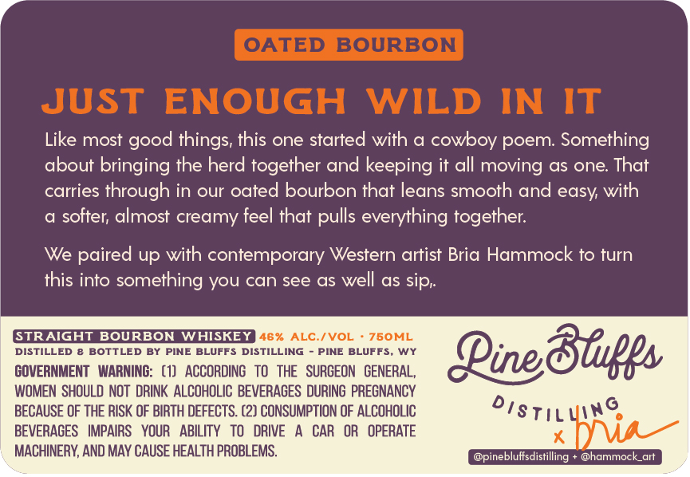
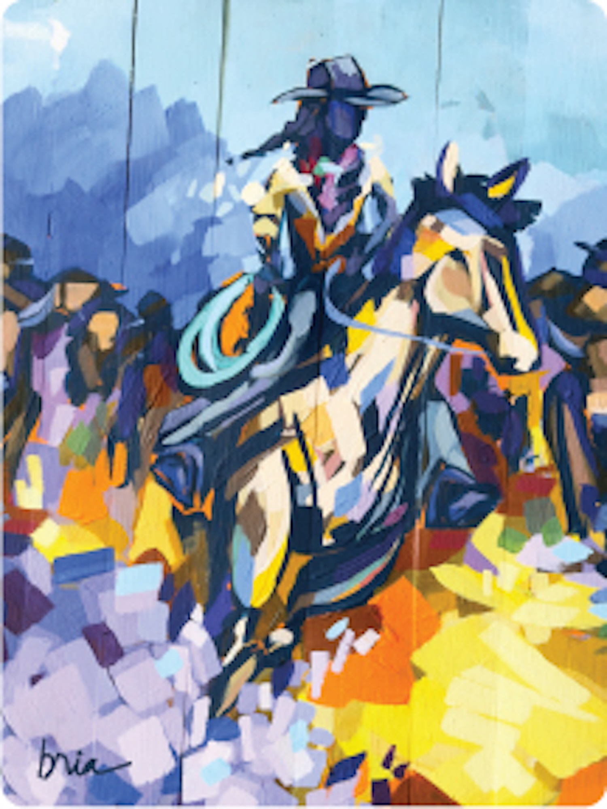

# TTB COLA Label Images - TTBID 26126001000869

**Brand Name:** PINE BLUFFS DISTILLING

**Fanciful Name:** OATED BOURBON

**Issue Date:** 05/12/2026

**Origin Code:** 49

**Product Class/Type:** 101

**Source:** [TTB Public COLA Registry](https://ttbonline.gov/colasonline/viewColaDetails.do?action=publicFormDisplay&ttbid=26126001000869)

## Label Images

### Back Label

### Front Label

### Label 2

## Extracted Label Text

*Text extracted via OCR - may contain errors*

*2 image(s) excluded: text did not meet readability threshold*

**Detected Proof:** 92

### Back Label

OATED BOURBON
JUST
ENOUGH
WILD
IN
IT
Like most good
this one started with & cowboy poem: Something
about bringing the herd together and keeping it all moving as one: That
carries through in our oated bourbon that leans smooth and easy with
softer; almost creamy feel that
everything together:
We paired up with contemporary Western artist Bria Hammock to turn
this into something you can see as well as sip;
GTRAIGHT BOURBON
WHISKEY
46 %
ALC /VOL
760ML
DISTILLED
BOTTLED BY
PINE BLUFFS
DISTILLING
PINE BLUFFS
wY
Pine 86gs
GOVERNMENT   WARNING:   (1)   ACCORDING   To  THE   SURGEON   GENERAL ,
WOMEN SHOULD NOT  DRINK  ALCOHOLIC BEVERAGES DURING PREGNANCY
BECAUSE OF THE RISK OF BIRTH DEFECTS. (2) CONSUMPTION OF ALCOHOLIC
BEVERAGES   IMPAIRS   YOUR
ABILITY
TO   DRIVE
CAR
OR
OPERATE
Dstilwat _
MACHINERY, AND MAY CAUSE HEALTH PROBLEMS
@pinebluffsdistilling
@hammock_art
things;
pulls
