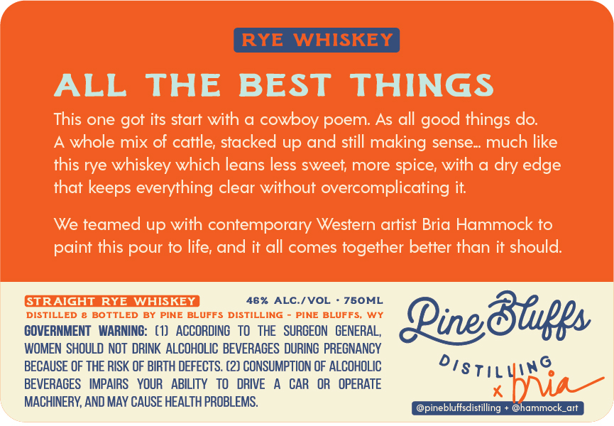
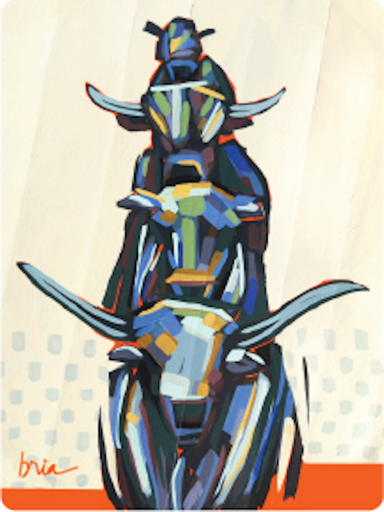

# TTB COLA Label Images - TTBID 26126001000872

**Brand Name:** PINE BLUFFS DISTILLING

**Issue Date:** 05/12/2026

**Origin Code:** 49

**Product Class/Type:** 102

**Source:** [TTB Public COLA Registry](https://ttbonline.gov/colasonline/viewColaDetails.do?action=publicFormDisplay&ttbid=26126001000872)

## Label Images

### Back Label

### Front Label

### Label 3

## Extracted Label Text

*Text extracted via OCR - may contain errors*

*2 image(s) excluded: text did not meet readability threshold*

**Detected Proof:** 92

### Back Label

RYE WHISKEY
ALL
THE
BEST
THINGS
This one
its start with a
cowboy poem: As all good things do:
A whole mix of cattle; stacked up and still making sense_ much like
this rye whiskey which leans less sweet; more spice; with
dry edge
that keeps everything clear without overcomplicating it:
We teamed up with contemporary Western artist Bria Hammock to
this pour to life; and it all comes together better than it should
GTRAIGHT RYE WHISKEY
46% ALC /VOL
750ML
DISTILLED
BOTTLED
PINE BLUFFS
DISTILLING
PINE BLUFFS
WY
Pine 8fugs
GOVERNMENT  WARNING:  (1)   ACCORDING  TOo  THE   SURGEON   GENERAL,
WOMEN SHOULD NOT  DRINK  ALCOHOLIC BEVERAGES DURING PREGNANCY
BECAUSE OF THE RISK OF BIRTH DEFECTS. (2) CONSUMPTION OF ALCOHOLIC
Distiliung
BEVERAGES   IMPAIRS   YOUR
ABILITY
TO   DRIVE
CAR
OR
OPERATE
Iiia
MACHINERY, AND MAY CAUSE HEALTH PROBLEMS.
@pinebluffsdistilling
@hammock_art
got
paint
