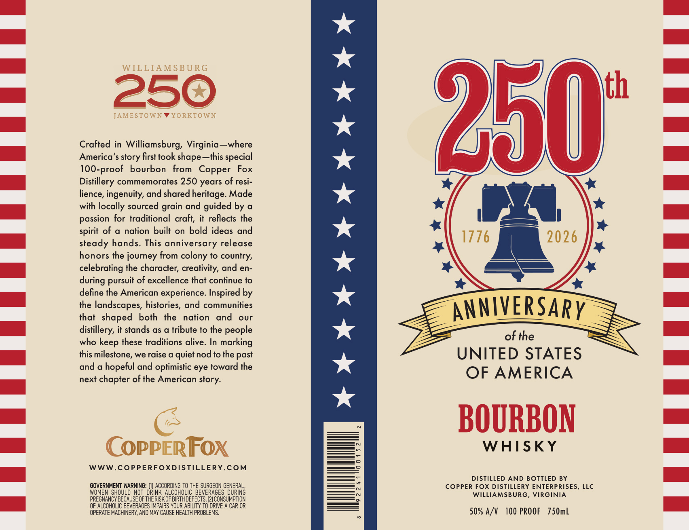

# TTB COLA Label Images - TTBID 26126001000899

**Brand Name:** 250TH ANNIVERSARY

**Issue Date:** 05/12/2026

**Origin Code:** 05

**Product Class/Type:** 101

**Source:** [TTB Public COLA Registry](https://ttbonline.gov/colasonline/viewColaDetails.do?action=publicFormDisplay&ttbid=26126001000899)

## Label Images

### Front Label

## Extracted Label Text

*Text extracted via OCR - may contain errors*

**Detected Proof:** 100

### Front Label

WILLIAMSBURG
25c
Ith
JAMESTOWN
YORKTOWN
250
Crafted in Williamsburg,  Virginia_where
America' $
first took
~this special
100-proof
bourbon
from
Copper
Fox
Distillery commemorates 250 years of resi-
lience, ingenuity, and shared heritage. Made
with locally sourced grain and guided by a
passion for traditional craft;
it  reflects the
spirit of
nation built on bold ideas and
steady hands. This anniversary release
1776
2026
honors the journey from colony to country,
celebrating the character; creativity, and en-
pursuit of excellence that continue to
define the American experience. Inspired by
the landscapes, histories, and communities
ANNIVERSARY
that  shaped
both
the
nation
and
our
distillery, it stands as a tribute to the people
who
these traditions alive. In marking
of the
this milestone, we raise a quiet nod to the past
UNITED STATES
and
hopeful and optimistic eye toward the
next
chapter of the American
OF AMERICA
BOURBON
COPPERFOX
WHISKY
WWW.COPPERFOXDISTILLERY.COM
DISTILLED
AND BOTTLED BY
GOVERNMENT WARNING:
ACCORDING To ThE SURGEON GENERAL,
COPPER FOX DISTILLERY ENTERPRISES, LLC
WOMEN ShOULd NOT  DRINK ALCOHOLIC BEVERAGES   DURING
WILLIAMSBURG, VIRGINIA
PREGNANCY BECAUSE OFTHERISK OF BIRTH DEFECTS. [2] CONSUMPTION
OF ALCOHOLIC BEVERAGES IMPAIRS YOUR ABILITY T0 DRIVE
CAR OR
OPERATE MACHINERY, AND MAY CAUSE HEALTH PROBLEMS .
50% A/v
100 PROOF
750mL
shape _
story
during
keep
story:
