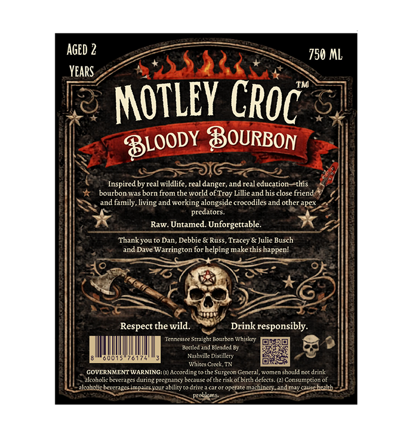
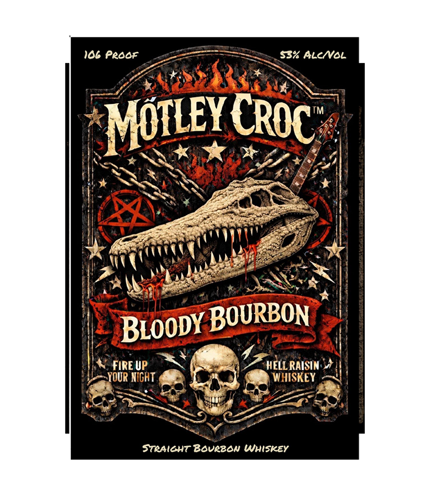

# TTB COLA Label Images - TTBID 26126001000918

**Brand Name:** MOTLEY CROC

**Issue Date:** 05/15/2026

**Origin Code:** 43

**Product Class/Type:** 101

**Source:** [TTB Public COLA Registry](https://ttbonline.gov/colasonline/viewColaDetails.do?action=publicFormDisplay&ttbid=26126001000918)

## Label Images

### Back Label

### Front Label

## Extracted Label Text

*Text extracted via OCR - may contain errors*

### Back Label

AGED 2
750 ML
Years
MOTLEY
BOURBON
Inspired by real wildlife, real danger,and real education
this
bourbon was born from the world of Troy Lillie and his close friend
and family, living
working alongside crocodiles and other apex
predators_
Raw. Untamed.
Unforgettable
Thankyou to Dan, Debbie &
& Julie Busch
Dave Warrington for helping make this happen!
Respect the wild.
Drink responsibly
Tcnncssec Straich Bourbon Whiskey
Portled ind Blended By
001
Nashrilke Distillery
Creck ,
GOVERNMENT WARNING
Accordingtothe Surgeon General,
Tnnanaen
should not drink
akcoholicbeverages during pregnancy beczuse oftherisk ofbirth defects. (2) Consumption of
akcoholicbcverages
Hnanene
'ourabilic
dec
Mae
operate michincn and maycaus-haakh
problems
CROC
BLOODY
and.
Russ,
Tncey
and,
Whe?

### Front Label

106 Peoor a, $B% ALCMVOL
Piss gS
reef é 3 a XN =
YCROC:.
A MOTLEY CRoc::
AGN Ket ays
ith SSN SUR Sa Sy LEE MS
Hie SS We Ay * ||
SSS gre |
eee - ee |
ee
a kh ae
veel NY adel ze. = |
[Aa ee oe S|)
Hs es eS
HN pectin eal
|< Broopy BOURBON’
is taf Puasa
ie eS ike at
WS preue) SN 7 Z- WELL RAISIN al
YeaYOUR NIGRT ( ee EY
OTS = ope
SF .
STRAIGHT Bovezow WHISKEY
