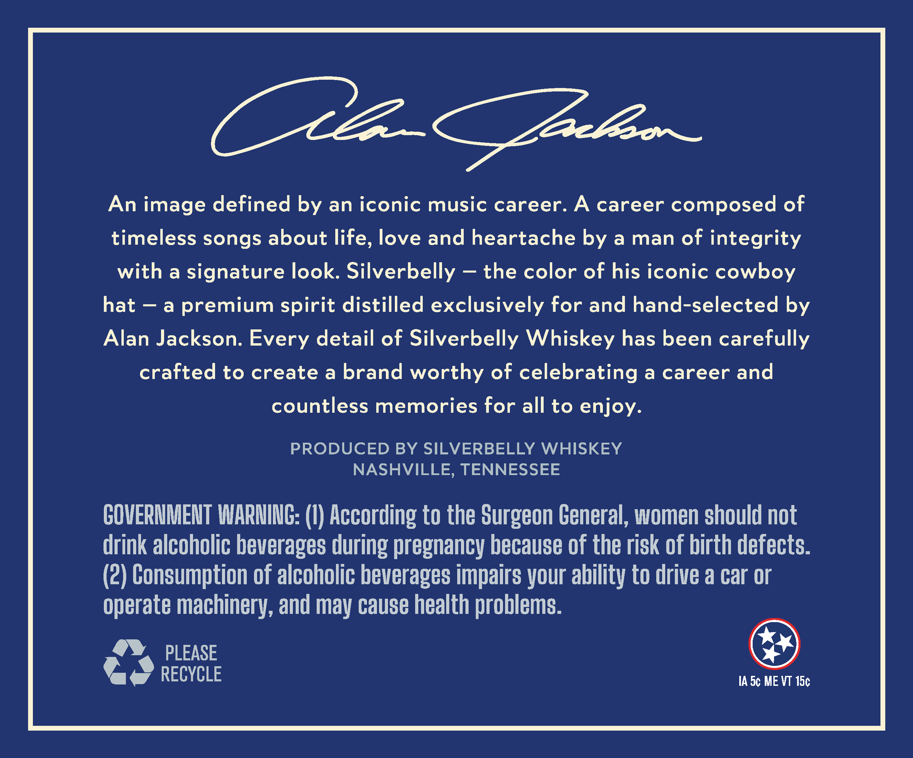
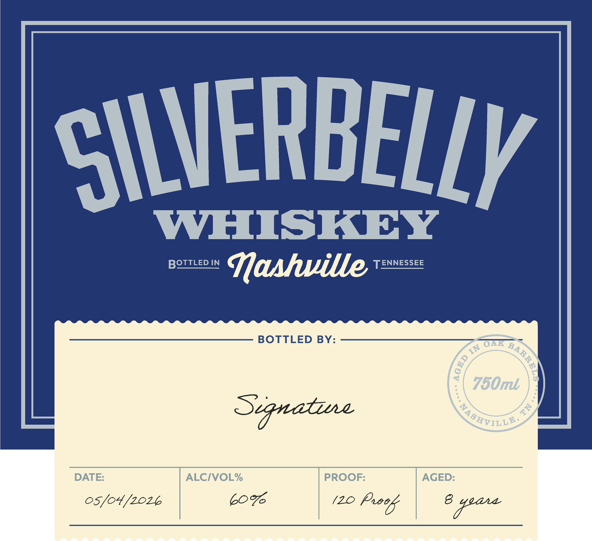

# TTB COLA Label Images - TTBID 26126001000961

**Brand Name:** SILVERBELLY WHISKEY

**Issue Date:** 05/13/2026

**Origin Code:** 43

**Product Class/Type:** 140

**Source:** [TTB Public COLA Registry](https://ttbonline.gov/colasonline/viewColaDetails.do?action=publicFormDisplay&ttbid=26126001000961)

## Label Images

### Back Label

### Front Label

## Extracted Label Text

*Text extracted via OCR - may contain errors*

### Back Label

AB Pater
An image defined by an iconic music career. A career composed of
timeless songs about life, love and heartache by a man of integrity
with a signature look. Silverbelly — the color of his iconic cowboy
hat — a premium spirit distilled exclusively for and hand-selected by
Alan Jackson. Every detail of Silverbelly Whiskey has been carefully
crafted to create a brand worthy of celebrating a career and
countless memories for all to enjoy.
PRODUCED BY SILVERBELLY WHISKEY
NASHVILLE, TENNESSEE
GOVERNMENT WARNING: (I) According to the Surgeon General, women should not
drink alcoholic beverages during pregnancy because of the risk of birth defects.
(2) Consumption of alcoholic beverages impairs your ability to drive a car or
operate machinery, and may cause health problems.
@® PLEASE &)
Ta RECYCLE Ade MEVT te

### Front Label

SILVERBELLY
WHISKEY
BOTTLED IN
Mashuille
TENNESSEE
BOTTLED BY:
OAK
750ml
Sygnatzue
DATE:
ALCIVOL%
PROOF:
AGED:
05/o4/2026
607
(20
Pxeeb
8
1
IN
3
E
Ya SHVILLY
seaa
