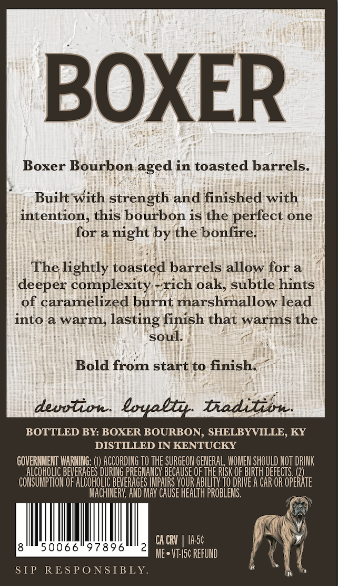
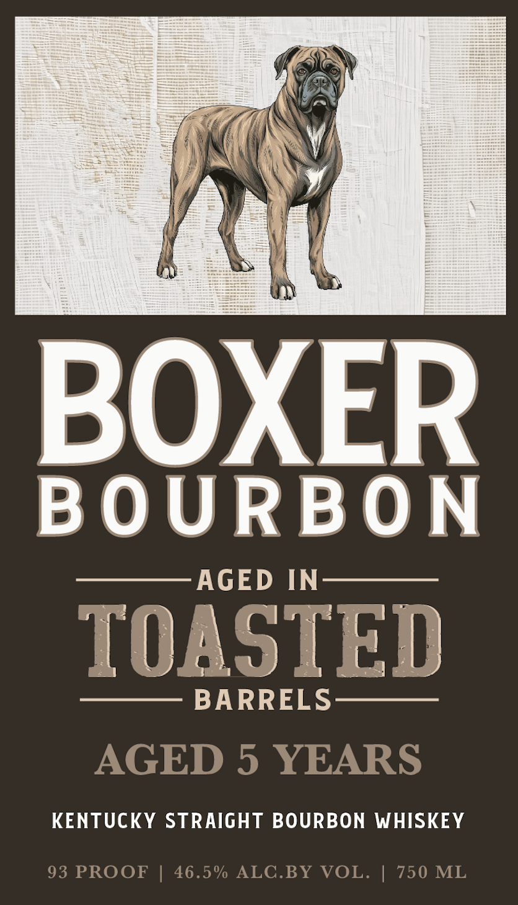

# TTB COLA Label Images - TTBID 26126001001087

**Brand Name:** BOXER BOURBON

**Issue Date:** 05/12/2026

**Origin Code:** 22

**Product Class/Type:** 101

**Source:** [TTB Public COLA Registry](https://ttbonline.gov/colasonline/viewColaDetails.do?action=publicFormDisplay&ttbid=26126001001087)

## Label Images

### Back Label

### Front Label

## Extracted Label Text

*Text extracted via OCR - may contain errors*

**Detected Proof:** 93
**Detected Age:** 5 Years

### Back Label

BOXER
Boxer Bourbon
in toasted barrels.
Built with strength and finished with
intention; this bourbon is the perfect one
for a
night by the bonfire
The lightly toasted barrels allow for a
deeper complexity -rich oak; subtle hints
of caramelized burnt marshmallow lead
into a warm;
lasting finish that warms the
soul
Bold from start to finish:
deuvtion:boyllr tditisn:
BOTTLED BY: BOXER BOURBON, SHELBYVILLE, KY
DISTILLED IN KENTUCKY
GOVERMMEIT WARNING:
ACCORDING TO THE SURGEOH GENERAL, WOMEN SHOULD NOT DRINK
AICOHOLIC BEVERAGES DURING PREGMANCY BECAUSE OF THE RISK QF BIRTH defects _(2)
CONSUMPTLOH OF ALCoHoLIC BeveRAGES IMPHIRS YOUR ABILITY To DRIVE A CAR OR OPERATe
MACHINERY, AND MHAY Cause HEALTH PROBLEMs:.
CA CRV
Ia5c
0066"97896
Me + VT-I5c RefuNd
S IP
RE S PONSIBLY.
aged

### Front Label

BOXER
BOURBON
AGED IN
TOASTED
BARRELS
AGED 5 YEARS
KENTUCKY STRAIGHT BOURBON WHISKEY
93 PROOF
46.5% ALC.BY VOL.
750 ML
