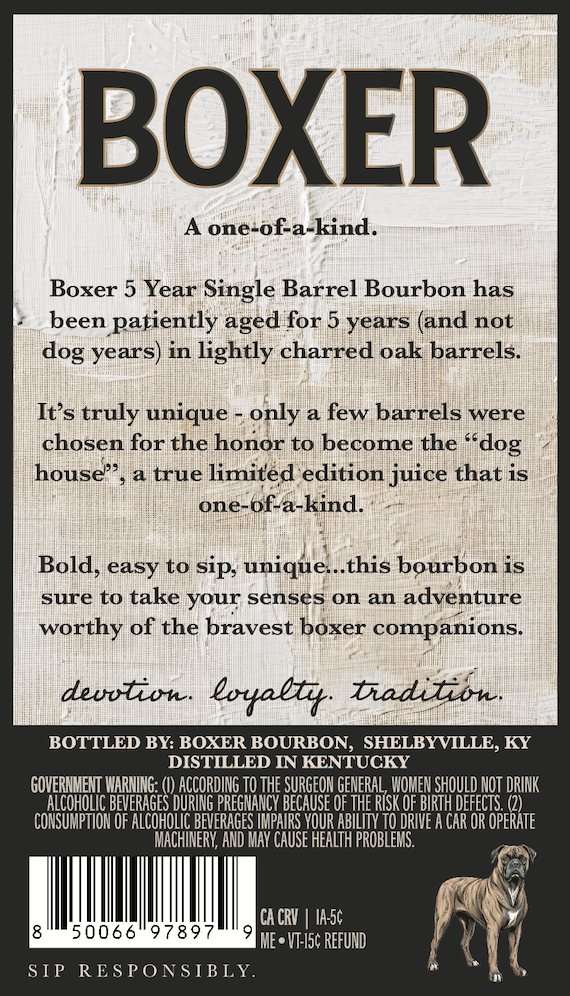
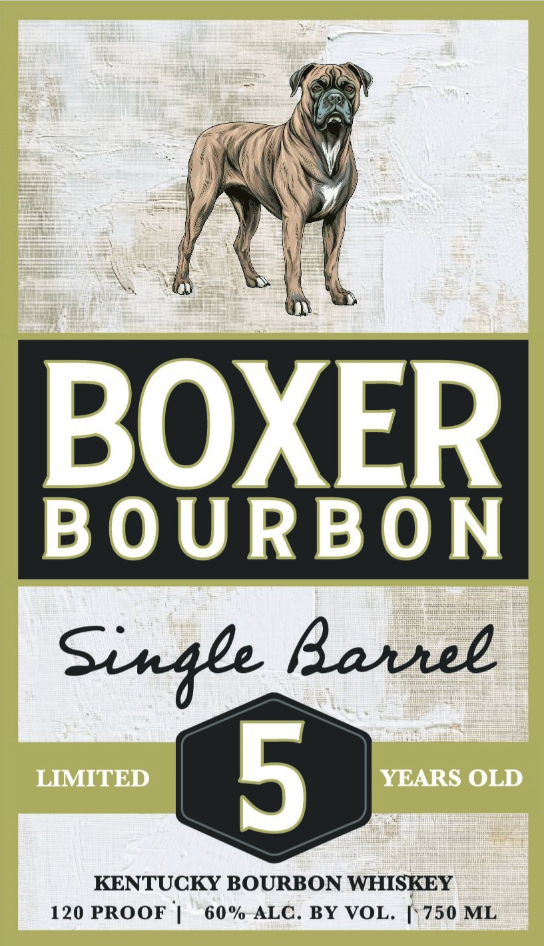

# TTB COLA Label Images - TTBID 26126001001088

**Brand Name:** BOXER BOURBON

**Issue Date:** 05/21/2026

**Origin Code:** 22

**Product Class/Type:** 141

**Source:** [TTB Public COLA Registry](https://ttbonline.gov/colasonline/viewColaDetails.do?action=publicFormDisplay&ttbid=26126001001088)

## Label Images

### Back Label

### Label 1

## Extracted Label Text

*Text extracted via OCR - may contain errors*

**Detected Proof:** 120
**Detected Age:** 5 Years

### Back Label

BOXER
one-of-a-kind.
Boxer 5
Single Barrel Bourbon has
been patiently
for 5 years (and not
years) in lightly charred oak barrels:
Its truly unique
only a few barrels were
chosen for the honor to become the
house"
a true limited edition juice that is
one-
of-a-kind
Bold; easy to sip; unique:_this bourbon is
sure to take your senses on an adventure
worthy of the bravest boxer companions
deuvtion
Loyallr
biadizibn;
BOTTLED BY: BOXER BOURBON, SHELBYVILLE, KY
DISTILLED IN KENTUCKY
GOVERMMENT WARMING:
ACCORDING TO thE SURGEON GENERAL, WOMEN SHOULD NOT DRINK
BEVERAGES DURING PREGMANCY BECAUSE OF THE RISK OF BIRTH DEFECTS
CoNSUFO
'TION OF ALCOHOLIC BEVERAGES IPAIRS YOUR ABILITy T0 DRIVE A CAR OR OPERaTe
MachINERY; AND MAY Cause HeaLth PROBLEMS.
CA CRV
Ia5c
50066"9789
Me . VT-Isc REFUND
S IP
RES PONSIBLY.
Year
aged
dog
~dog

### Label 1

BOXER
BOURBON
Sinale Barree
LIMITED
5
YEARS OLD
KENTUCKY BOURBON WHISKEY
120 PROOF
60 % ALC. BY VOL.
750 ML
