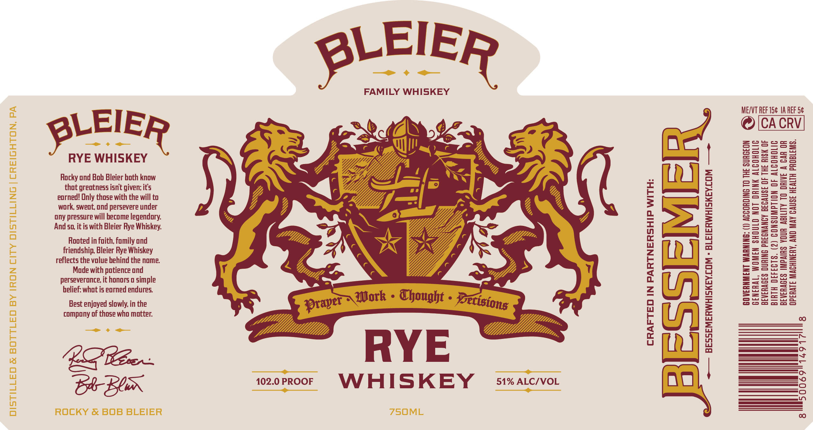

# TTB COLA Label Images - TTBID 26127001000048

**Brand Name:** BLEIER

**Issue Date:** 05/12/2026

**Origin Code:** 39

**Product Class/Type:** 142

**Source:** [TTB Public COLA Registry](https://ttbonline.gov/colasonline/viewColaDetails.do?action=publicFormDisplay&ttbid=26127001000048)

## Label Images

### Label 1

## Extracted Label Text

*Text extracted via OCR - may contain errors*

### Label 1

BLEIER

FAMILY WHISKEY
E/VT REF 15¢ 1A REF 5¢

CA CRV

LEIER

RYE WHISKEY

Rocky ond Bob Bleier both know
thot greatness isn't given; it's
eorned! Only those with the will to
work, sweot, ond persevere under
ony pressure will become legendary.
And so, it is with Bleier Rye Whiskey.

Rooted in faith, family ond
friendship, Bleier Rye Whiskey
reflects the volue behind the nome.
Made with potience ond
perseverance, it honors o simple
belief: whot is eorned endures.

RL

+— BESSEMERWHISKEY.COM - BLEIERWHISKEY.COM —~

=
Sl
a
o
c
=
Cc
oo
==
—
=
=
o
=
a
=
o
o
3
=
s
=
=
cs
=
=
—
=
ry
=
=
cs
a
=>
o
oa

BIRTH DEFECTS. (2) CONSUMPTION OF ALCOHOLIC

BEVERAGES IMPAIRS YOUR ABILITY TO DRIVE A GAR OR
OPERATE MACHINERY, AND MAY GAUSE HEALTH PROBLEMS.

GENERAL, WOMEN SHOULD NOT DRINK ALCOHOLIC
BEVERAGES DURING PREGNANCY BECAUSE OF THE RISK OF

Best enjoyed slowly, in the
compony of those who matter.

EG har

CABIN 1o2.0PRO0F =VYVHISKEY 9 s1%atc/vor

CRAFTED IN PARTNERSHIP WITH:
