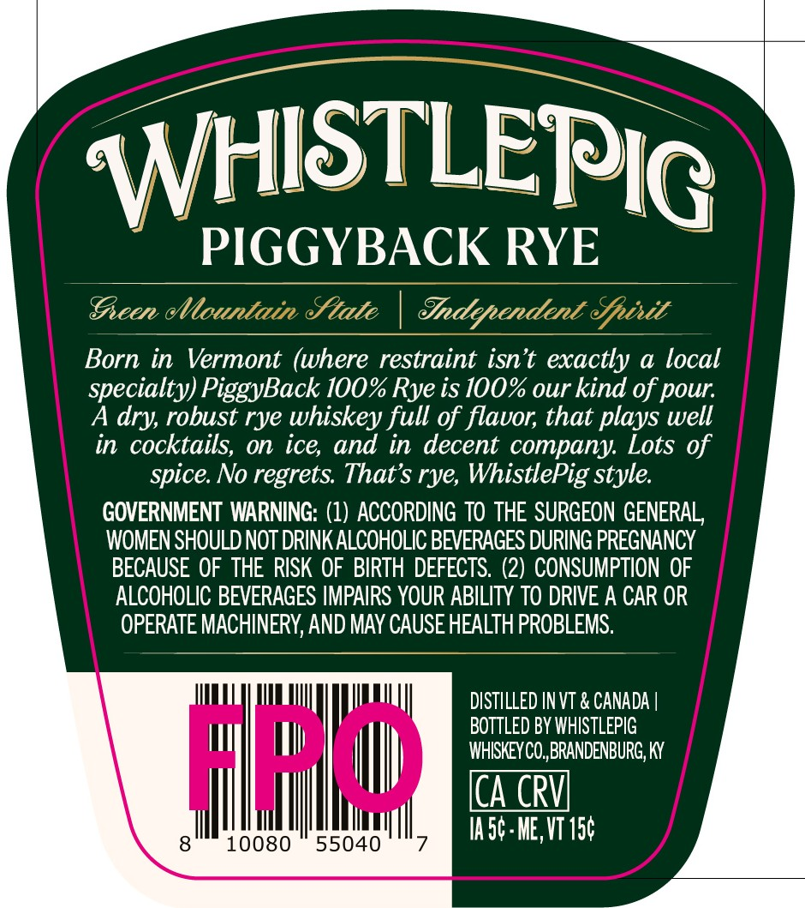
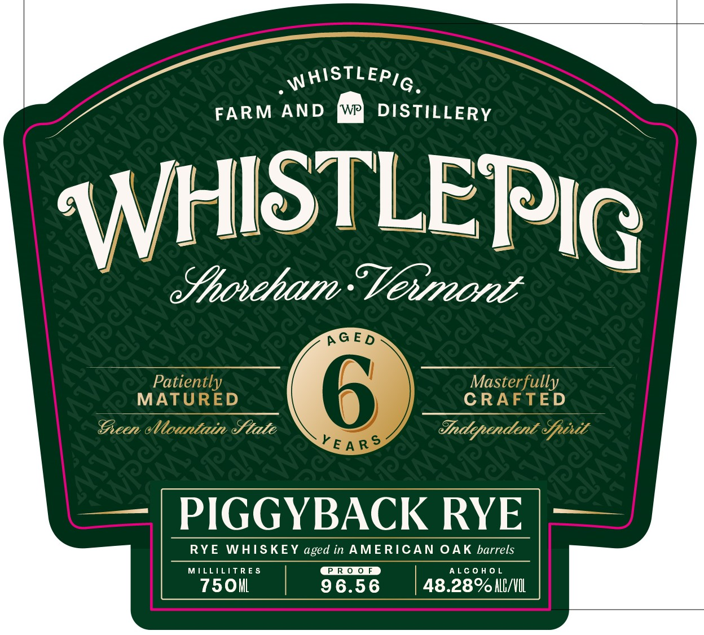

# TTB COLA Label Images - TTBID 26127001000082

**Brand Name:** WHISTLEPIG

**Issue Date:** 05/13/2026

**Origin Code:** 22

**Product Class/Type:** 142

**Source:** [TTB Public COLA Registry](https://ttbonline.gov/colasonline/viewColaDetails.do?action=publicFormDisplay&ttbid=26127001000082)

## Label Images

### Back Label

### Front Label

### Label 2

## Extracted Label Text

*Text extracted via OCR - may contain errors*

### Back Label

WHISTLEP IG

" PIGGYBACK RYE

Gren ¢ , We Old

Stale Trdeprendent Sprit Se

Born in Vermont (where restraint isn’t exactly a local
specialty) PiggyBack 100% Rye is 100% our kind of pour.

A dry, robust rye whiskey full of flavor, that plays well

in cocktails, on ice, and in decent company. Lots of
spice. No regrets. That's rye, WhistlePig style.
GOVERNMENT WARNING: (1) ACCORDING TO THE SURGEON GENERAL,
WOMEN SHOULD NOT DRINK ALCOHOLIC BEVERAGES DURING PREGNANCY
BECAUSE OF THE RISK OF BIRTH DEFECTS. (2) CONSUMPTION OF
ALCOHOLIC BEVERAGES IMPAIRS YOUR ABILITY TO DRIVE A CAR OR
OPERATE MACHINERY, AND MAY CAUSE HEALTH PROBLEMS

DISTILLED IN VT & CANADA |
BOTTLED BY WHISTLEPIG
WHISKEY CO, BRANDENBURG, KY

CA CRV

goose soso 7 LR

### Front Label

A6e
WHISTLEPIG_
A
FARM AND
W
DISTILLERY
"
2
A
WHISTLEPIG
4a
Yhoveham
8'
RS_e
AG
Smone
34fe
C
MPatieRlgd
6
Cesterfulv
Sieen c ountain &tate
Endependent epixit
YE A RS
PIGGYBACK RYE
RYE
WHIS KEY
in AMERICAN OAK barrels
MILLILTTRE $
P R 0 0 F
ALC 0 H 0 L
7501ll
96.56
48.28% ALB/VIL
AelR
W
c
E D
SR
NSC
2
aged

### Label 2

}

AACE Com
Sten PE

FARM AND DISTILLERY

>
on
4
iS)
<x
acl
=
i}
=
o.

JAY MOVEADOId

Dick TSIHM, |

©
7
2
=

teen Mountain Stale « Sndypndenl Sprit
