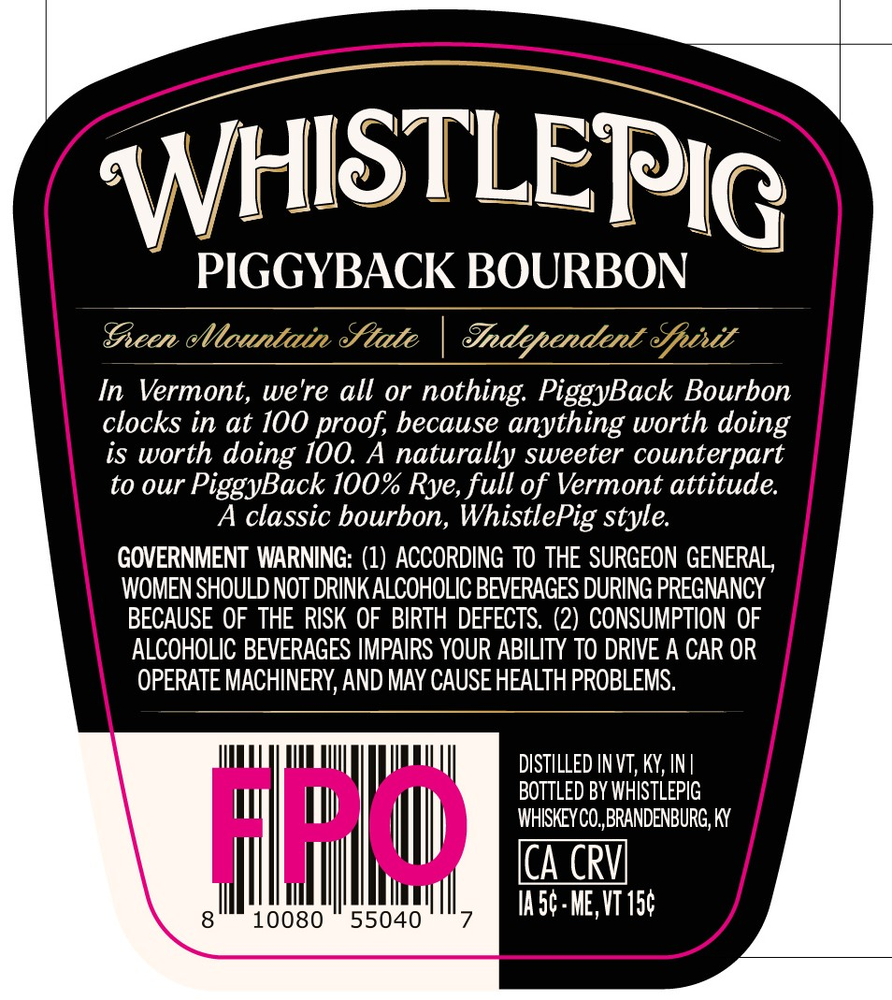
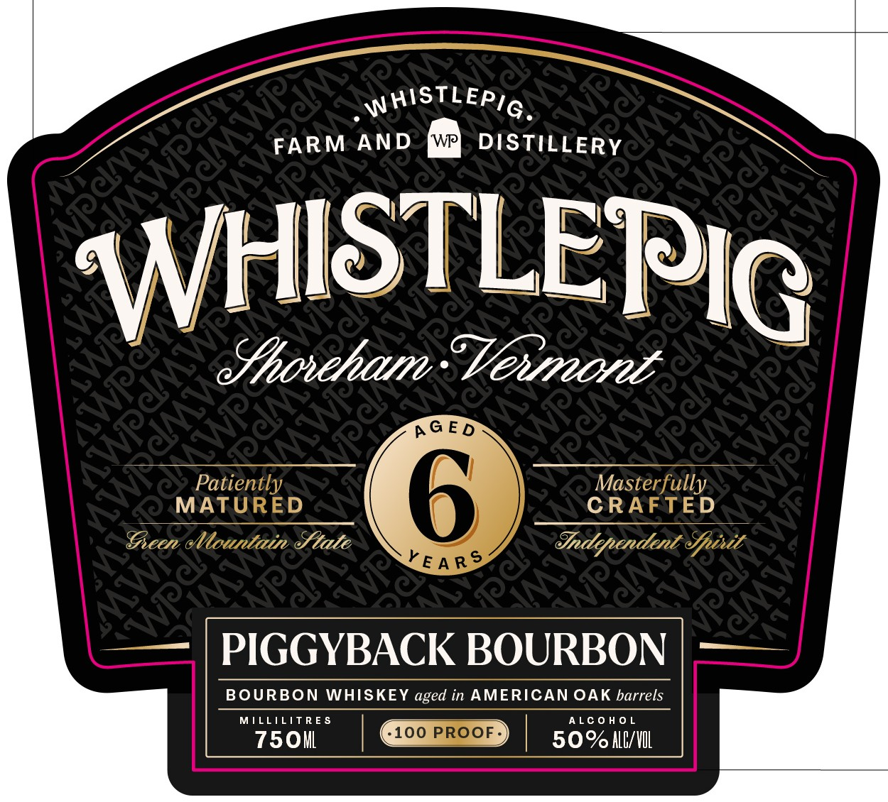
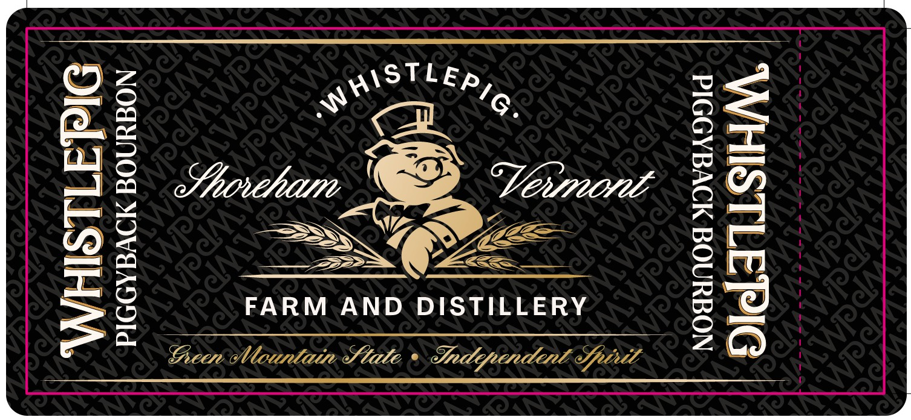

# TTB COLA Label Images - TTBID 26127001000099

**Brand Name:** WHISTLEPIG

**Issue Date:** 05/13/2026

**Origin Code:** 22

**Product Class/Type:** 141

**Source:** [TTB Public COLA Registry](https://ttbonline.gov/colasonline/viewColaDetails.do?action=publicFormDisplay&ttbid=26127001000099)

## Label Images

### Back Label

### Front Label

### Label 2

## Extracted Label Text

*Text extracted via OCR - may contain errors*

**Detected Proof:** 100

### Back Label

—

TLEP

IR

WHS

PIGGYBACK BOURBON

Geen Mountain Stale | Sn ehifectelitee Spit

In Vermont, we're all or nothing. PiggyBack Bourbon

clocks in at 100 proof, because anything worth doing

is worth doing 100. A naturally sweeter counterpart

to our PiggyBack 100% Rye, full of Vermont attitude.

A classic bourbon, WhistlePig style.

GOVERNMENT WARNING: (1) ACCORDING TO THE SURGEON GENERAL,

WOMEN SHOULD NOT DRINK ALCOHOLIC BEVERAGES DURING PREGNANCY

BECAUSE OF THE RISK OF BIRTH DEFECTS. (2) CONSUMPTION OF

ALCOHOLIC BEVERAGES IMPAIRS YOUR ABILITY TO DRIVE A CAR OR

OPERATE MACHINERY, AND MAY CAUSE HEALTH PROBLEMS

DISTILLED INVT, KY, IN|

BOTTLED BY WHISTLEPIG

WHISKEY CO, BRANDENBURG, KY

CA CRV

IA5¢- ME, VT 15¢

8

10080 55040

7

### Front Label

atts RN

FARM AND wr] DISTILLERY

Nul ISTLEPIg

Master full
CRAFTED

Sadlepuenderi Shttt

PIGGYBACK BOURBON

BOURBON WHISKEY aged in AMERICAN OAK barrels

"750n | QED | soocuvn

### Label 2

Oo—

as Di.)

ans

Ae

faoriliitre

VEVPUVUE

”

wD

=.

Yea

or

mm

Sere A as

<=

=m

Ls

FARM AND DISTILLERY

oa

Peer ¢

litte Stale, © Spe eliferetitl Spirit
